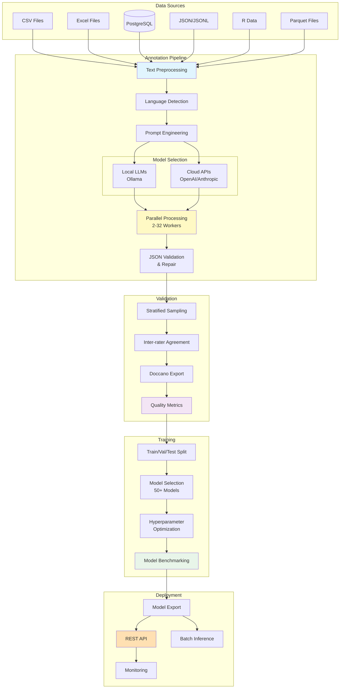
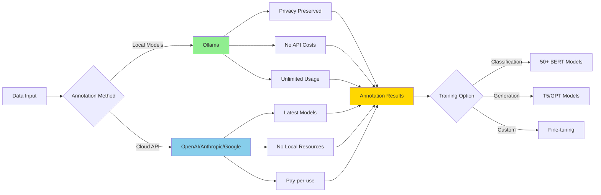

<div align="center">

```
╔══════════════════════════════════════════════════════════════════╗
║                                                                  ║
║                     ╦  ╦  ╔╦╗  ╔╦╗┌─┐┌─┐┬                        ║
║                     ║  ║  ║║║   ║ │ ││ ││                        ║
║                     ╩═╝╩═╝╩ ╩   ╩ └─┘└─┘┴─┘                      ║
║                                                                  ║
║         Advanced Annotation Pipeline for Social Sciences         ║
║                                                                  ║
╚══════════════════════════════════════════════════════════════════╝
```

[](https://www.python.org/downloads/)
[](https://opensource.org/licenses/MIT)
[](https://github.com/psf/black)

</div>

## Overview

**LLMTool** represents a comprehensive annotation framework designed specifically for computational social science research. This system enables researchers to leverage state-of-the-art language models for systematic text annotation, validation, and classification model training. The architecture emphasizes accessibility, reproducibility, and methodological rigor in automated content analysis.

### Core Philosophy

The proliferation of large language models has created unprecedented opportunities for social science research. However, existing tools often lack the necessary infrastructure for rigorous scientific inquiry. LLMTool bridges this gap through:

- **Systematic annotation workflows** with built-in quality control mechanisms
- **Multi-model support** for comparative analysis and validation
- **Transparent methodology** through comprehensive logging and reproducibility features
- **Accessible interface** designed for researchers without extensive programming expertise

## Architecture

### System Overview



## Key Features

### Data Processing Capabilities

The system accommodates diverse data formats commonly used in social science research:

#### Input Formats
- **CSV**: Standard comma/tab/pipe delimited (pandas)
- **Excel**: .xlsx, .xls with multi-sheet support (openpyxl)
- **Parquet**: Columnar storage for large datasets (pyarrow)
- **JSON/JSONL**: Structured and line-delimited (native)
- **RData/RDS**: R workspace and serialized objects (pyreadr)
- **PostgreSQL**: Direct database queries with connection pooling
- **SQLite**: Local database files
- **TSV**: Tab-separated values
- **Feather**: Fast binary columnar format

#### Data Specifications
- **Size limits**: 1 row to 10M+ rows
- **Text length**: 1 character to 100,000 characters per document
- **Column types**: String, numeric, datetime, categorical
- **Encoding**: UTF-8, Latin-1, Windows-1252 auto-detection
- **Memory management**: Chunked processing for large files

### Language Model Integration

LLMTool provides seamless integration with multiple model providers:

#### Local Models (via Ollama)

**Compatible with All Ollama Models**

The system works with any model available through Ollama. Examples include:
- **Llama 3.3**: 70B parameters (most capable)
- **Gemma 2**: 27B parameters (Google's model)
- **Mixtral**: 8x7B mixture of experts
- **Qwen 2.5**: Chinese-English bilingual
- **DeepSeek R1**: Reasoning-optimized
- **Command-R**: Retrieval-augmented
- **Phi-3**: Microsoft's efficient model
- **And 50+ more models** available in Ollama's library

#### Cloud APIs

Including, for now :

**OpenAI**
- GPT-4o, GPT-4-turbo: Latest models with 128k context
- GPT-3.5-turbo: Cost-effective option
- JSON mode and function calling support

### Annotation Workflow

The annotation process implements several methodological innovations:

1. **Automatic Text Preprocessing**
   - Language detection for 100+ languages (via langdetect/langid)
   - UTF-8/Latin-1 encoding normalization
   - Duplicate detection using SHA-256 hashing
   - Text segmentation with configurable chunk sizes (512-8192 tokens)

2. **Parallel Processing Architecture**
   - ProcessPoolExecutor with 2-32 configurable workers
   - Batch sizes from 10 to 10,000 documents
   - Automatic retry with exponential backoff (5 attempts max)
   - Resume capability from checkpoint files

3. **Prompt Engineering Framework**
   - Jinja2 template engine for dynamic prompts
   - Variable substitution from CSV columns
   - Sequential multi-prompt processing (up to 10 prompts)
   - Context window management (2k-128k tokens depending on model)

4. **Quality Assurance**
   - JSON validation with automatic repair via regex patterns
   - Pydantic schema enforcement for structured outputs
   - Response caching to avoid redundant API calls
   - Inference time tracking per document

### Validation Methodology

The validation module implements rigorous quality control measures:

#### Statistical Metrics
- **Cohen's Kappa (κ)**: Binary and multi-class agreement (0-1 scale)
- **Krippendorff's Alpha (α)**: Multi-rater reliability for ordinal/nominal data
- **Fleiss' Kappa**: Multi-rater agreement for categorical ratings
- **Gwet's AC1/AC2**: Paradox-resistant agreement coefficients
- **Percentage Agreement**: Simple agreement rate with chance correction

#### Sampling Strategies
- **Stratified Sampling**: Maintains label distribution (5%, 10%, 20%, 50% options)
- **Random Sampling**: Uniform selection across dataset
- **Uncertainty Sampling**: Focus on low-confidence predictions
- **Diversity Sampling**: Maximum representation of text variety

#### Export Formats
- **Doccano**: JSONL with text, labels, metadata for web-based review
- **Label Studio**: JSON with annotations and pre-annotations
- **Prodigy**: JSONL with accept/reject/ignore interface
- **CSV**: Simple format for spreadsheet review
- **Excel**: Multi-sheet with statistics and samples

#### Quality Thresholds
- **Minimum Agreement**: 0.6 (substantial), 0.8 (almost perfect)
- **Confidence Scores**: 0.5 (low), 0.7 (medium), 0.9 (high)
- **Sample Sizes**: Statistical power calculations for significance

### Model Training Infrastructure

The training pipeline supports comprehensive model development:

#### Supported Architectures (50+ models)

**Implemented Models (from HuggingFace)**

**Core Models**
- BERT (base, large): Original transformer architecture
- RoBERTa (base, large): Robustly optimized BERT
- DeBERTa v3 (xsmall, base, large): State-of-the-art with disentangled attention
- DistilBERT: 40% smaller, 60% faster
- ALBERT (base, large, xlarge): Parameter-efficient with factorized embeddings
- ELECTRA (small, base, large): Efficient pre-training

**Multilingual Models**
- XLM-RoBERTa (base, large): 100+ languages
- mBERT: 104 languages
- mDeBERTa v3: State-of-the-art multilingual

**French-Specific Models**
- CamemBERT (base): French RoBERTa
- FlauBERT (base, large): French BERT
- BARThez: French sequence-to-sequence
- FrALBERT: French ALBERT
- DistilCamemBERT: Distilled French model

**Long-Context Models**
- Longformer: 4,096 token context
- BigBird: Sparse attention for long documents

#### Training Features
- **Data Splitting**: 60/20/20 or 70/15/15 or 80/10/10 splits
- **Batch Sizes**: 4, 8, 16, 32, 64 (auto-adjusted for GPU memory)
- **Learning Rates**: 1e-5 to 5e-5 with warmup (10% of steps)
- **Optimizers**: AdamW, Adam, SGD with weight decay
- **Schedulers**: Linear, cosine, polynomial decay
- **Mixed Precision**: FP16/BF16 training for 2x speed
- **Gradient Accumulation**: Effective batch sizes up to 512
- **Early Stopping**: Patience of 2-10 epochs
- **Checkpointing**: Every epoch + best model saving

## Installation

### System Requirements

```bash
# Core dependencies
Python >= 3.8
Memory >= 8GB RAM (16GB recommended for large models)
Storage >= 20GB available space
```

### Standard Installation

```bash
# Clone repository
git clone https://github.com/antoine-lemor/LLMTool.git
cd LLMTool

# Create virtual environment
python -m venv venv
source venv/bin/activate  # On Windows: venv\Scripts\activate

# Install dependencies
pip install -r requirements.txt

# Install Ollama (for local models)
# macOS/Linux:
curl -fsSL https://ollama.ai/install.sh | sh

# Pull a model
ollama pull llama3.3
```

### Development Installation

```bash
# Install with development dependencies
pip install -e ".[dev]"

# Install pre-commit hooks
pre-commit install
```

## Concrete Example: Political Text Classification

### Complete Pipeline Workflow

```mermaid
graph LR
    subgraph "1. Input Data"
        A[Parliamentary Debate:<br/>"The government should<br/>increase funding for<br/>renewable energy research<br/>to combat climate change"]
    end

    subgraph "2. LLM Annotation"
        B[Prompt Engineering]
        C[LLM Processing<br/>Llama 3.3 70B]
        D[JSON Output:<br/>topic: environment<br/>stance: supportive<br/>policy_area: energy]
    end

    subgraph "3. Dataset Building"
        E[1000 texts annotated<br/>by LLM]
        F[Train: 700<br/>Val: 150<br/>Test: 150]
    end

    subgraph "4. Model Training"
        G[Fine-tune<br/>CamemBERT]
        H[Hyperparameter<br/>Optimization]
        I[Best Model<br/>F1: 0.89]
    end

    subgraph "5. Production"
        J[Deploy Model]
        K[Classify 100k<br/>documents<br/>in 10 minutes]
    end

    A --> B
    B --> C
    C --> D
    D --> E
    E --> F
    F --> G
    G --> H
    H --> I
    I --> J
    J --> K

    style A fill:#e3f2fd
    style D fill:#fff9c4
    style I fill:#e8f5e9
    style K fill:#ffe0b2
```

### Step-by-Step Example

#### Step 1: Prepare Your Data
```csv
text,source,date
"We must accelerate the transition to clean energy",Parliament,2025-01-15
"The carbon tax is hurting small businesses",Opposition,2025-01-16
"Investment in public transit reduces emissions",Committee,2025-01-17
```

#### Step 2: Create Annotation Prompt
```python
prompt = '''
Classify this political text into:
- Topic: [economy, environment, health, education, defense]
- Stance: [supportive, neutral, opposed]
- Sentiment: [positive, neutral, negative]

Text: {text}

Return JSON only.
'''
```

#### Step 3: Run LLM Annotation
```python
from llm_tool.pipelines.pipeline_controller import PipelineController

config = {
    'data_source': 'csv',
    'file_path': 'political_texts.csv',
    'text_column': 'text',
    'annotation_model': 'llama3.3:70b',
    'prompts': [{
        'template': prompt,
        'expected_keys': ['topic', 'stance', 'sentiment']
    }],
    'batch_size': 50,
    'max_workers': 4
}

controller = PipelineController()
results = controller.run_annotation(config)
```

#### Step 4: Validate Annotations
```python
# Sample output for human review
{
    "text": "We must accelerate the transition to clean energy",
    "annotation": {
        "topic": "environment",
        "stance": "supportive",
        "sentiment": "positive"
    },
    "confidence": 0.92
}
```

#### Step 5: Train Classification Model
```python
# Automatic training on annotated data
training_config = {
    'input_file': 'annotations.json',
    'model_type': 'camembert-base',  # For French texts
    'max_epochs': 10,
    'early_stopping_patience': 3
}

model = controller.run_training(training_config)
# Output: Best F1 score: 0.89
```

#### Step 6: Deploy for Large-Scale Classification
```python
# Classify 100,000 documents
inference_config = {
    'model_path': 'models/best_model',
    'input_file': 'large_dataset.csv',
    'batch_size': 1000
}

predictions = controller.run_inference(inference_config)
# Processing speed: ~10,000 docs/minute
```

### Results Comparison

| Approach | Setup Time | Cost | Speed | Accuracy |
|----------|------------|------|-------|----------|
| Manual Annotation | Weeks | $10,000+ | 50 docs/day | 85-95% |
| LLM Only (GPT-4) | Hours | $500-2000 | 100 docs/min | 88-92% |
| **LLMTool Pipeline** | **Hours** | **$50-200** | **10,000 docs/min** | **85-90%** |

## Usage Examples

### Command Line Interface

The system provides an intuitive CLI with automatic detection capabilities:

```bash
# Launch interactive interface
python -m llm_tool.cli.advanced_cli

# Direct annotation
python -m llm_tool.cli.advanced_cli annotate \
    --input data/texts.csv \
    --model llama3.3 \
    --prompt prompts/sentiment.txt \
    --output results/annotations.json
```

### Python API

```python
from llm_tool.pipelines.pipeline_controller import PipelineController

# Initialize pipeline
controller = PipelineController()

# Configure annotation
config = {
    'data_source': 'csv',
    'file_path': 'data/survey_responses.csv',
    'text_column': 'response',
    'annotation_model': 'llama3.3',
    'prompts': [{
        'template': 'Classify sentiment as positive, neutral, or negative',
        'expected_keys': ['sentiment'],
    }],
    'run_validation': True,
    'validation_sample_size': 100,
    'run_training': True,
    'training_model_type': 'roberta-base'
}

# Execute pipeline
results = controller.run_pipeline(config)
```

## Research Applications

LLMTool has been designed for diverse social science applications:

### Political Science
- Legislative debate analysis
- Policy document classification
- Electoral discourse examination
- Public opinion mining

### Sociology
- Interview transcript coding
- Social media content analysis
- Survey response categorization
- Narrative analysis

### Communication Studies
- Media framing analysis
- Discourse analysis
- Content moderation research
- Misinformation detection

## Language Support

The system provides comprehensive multilingual capabilities:

### Supported Languages by Model Category

| Language | LLM Annotation | BERT Training | Specific Models |
|----------|---------------|---------------|-----------------|
| English | ✓ All LLMs | ✓ 15+ models | BERT, RoBERTa, DeBERTa, ALBERT |
| French | ✓ All LLMs | ✓ 8+ models | CamemBERT, FlauBERT, BARThez |
| Spanish | ✓ All LLMs | ✓ 5+ models | BETO, RoBERTa-es, BERTIN |
| German | ✓ All LLMs | ✓ 4+ models | GBERT, GottBERT, German-BERT |
| Chinese | ✓ All LLMs | ✓ 6+ models | BERT-Chinese, RoBERTa-zh, MacBERT |
| Arabic | ✓ All LLMs | ✓ 3+ models | AraBERT, CAMeLBERT, ArabicBERT |
| Portuguese | ✓ All LLMs | ✓ 3+ models | BERTimbau, PTT5 |
| Italian | ✓ All LLMs | ✓ 2+ models | UmBERTo, GilBERTo |
| Dutch | ✓ All LLMs | ✓ 2+ models | BERTje, RobBERT |
| Japanese | ✓ All LLMs | ✓ 3+ models | BERT-Japanese, RoBERTa-ja |
| Korean | ✓ All LLMs | ✓ 2+ models | KoBERT, KoELECTRA |
| Russian | ✓ All LLMs | ✓ 3+ models | RuBERT, RuRoBERTa |
| Turkish | ✓ All LLMs | ✓ 2+ models | BERTurk, ELECTRA-tr |
| **100+ others** | ✓ via mBERT/XLM | ✓ XLM-RoBERTa | Multilingual models |

### Model Flexibility



## Configuration

The system uses hierarchical configuration management:

```yaml
# config/settings.yaml
annotation:
  batch_size: 100
  max_workers: 4
  retry_attempts: 3
  timeout: 30

validation:
  sample_size: 0.1
  min_agreement: 0.7
  export_format: jsonl

training:
  epochs: 10
  batch_size: 16
  learning_rate: 2e-5
  early_stopping_patience: 3
```

## Contributing

We welcome contributions from the research community. Please refer to our [Contributing Guidelines](CONTRIBUTING.md) for detailed information on:

- Code style conventions
- Testing requirements
- Documentation standards
- Pull request process

## Citation

If you use LLMTool in your research, please cite:

```bibtex
@software{lemor2025llmtool,
  author = {Lemor, Antoine},
  title = {LLMTool: An Advanced Annotation Pipeline for Social Sciences},
  year = {2025},
  url = {https://github.com/antoine-lemor/LLMTool}
}
```

## License

This project is licensed under the MIT License. See [LICENSE](LICENSE) file for details.

## Acknowledgments

This project builds upon foundational work in computational social science and natural language processing. We acknowledge the contributions of the open-source community and the transformative impact of transformer architectures on text analysis methodologies.

---

<div align="center">

**Advancing Social Science Research Through Accessible AI**

[Documentation](https://llmtool.readthedocs.io) • [Examples](examples/) • [Issues](https://github.com/antoine-lemor/LLMTool/issues)

</div>
python -m pip install --upgrade pip

# Install with all dependencies
pip install -e ".[all]"
```

### Memory Issues
```python
# Reduce batch size
config['batch_size'] = 8

# Use smaller models
config['model'] = 'bert-base'  # instead of bert-large
```

### Ollama Connection
```bash
# Check Ollama is running
ollama list

# Start Ollama service
ollama serve
```

## Development

```bash
# Install in development mode
pip install -e ".[dev]"

# Run tests
pytest tests/

# Format code
black llm_tool/
flake8 llm_tool/
```

## License

MIT License - see [LICENSE](LICENSE) file

## Author

**Antoine Lemor**
Computational Social Science Laboratory

## Acknowledgments

- Ollama team for local LLM infrastructure
- HuggingFace for transformer implementations
- Open-source NLP community

---

For bugs, questions, or contributions: [github.com/antoine-lemor/LLMTool](https://github.com/antoine-lemor/LLMTool)