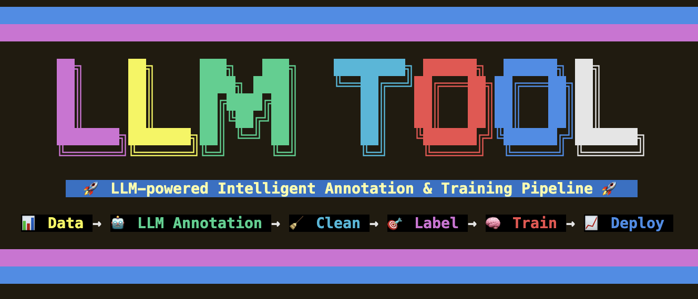
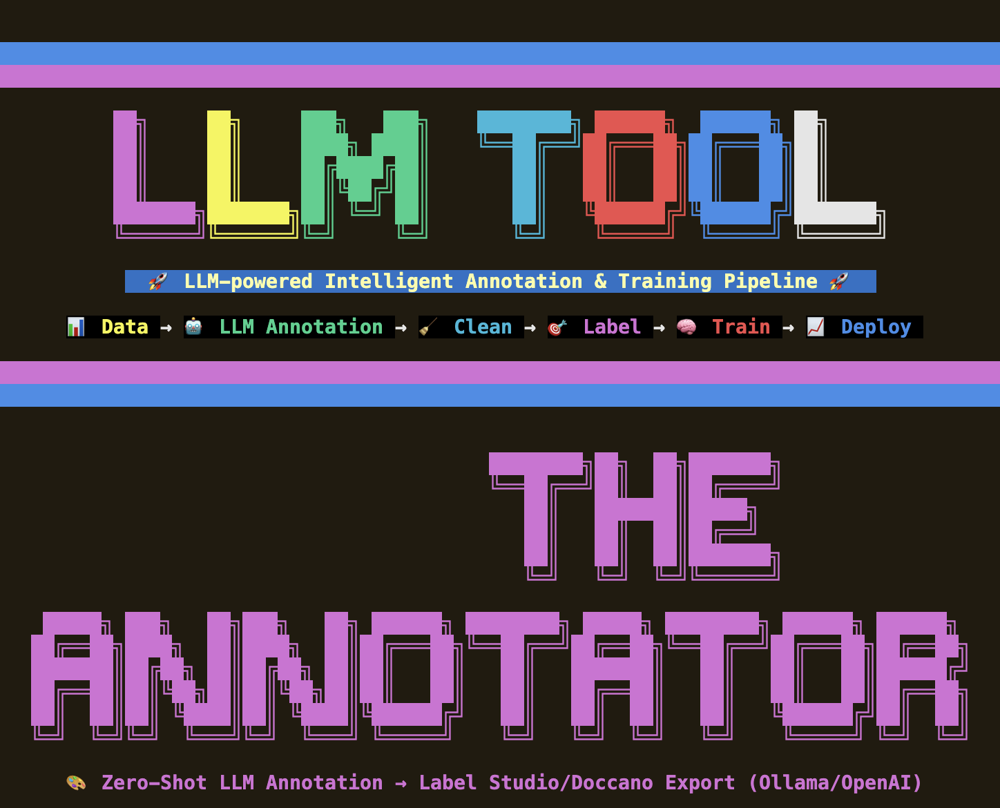
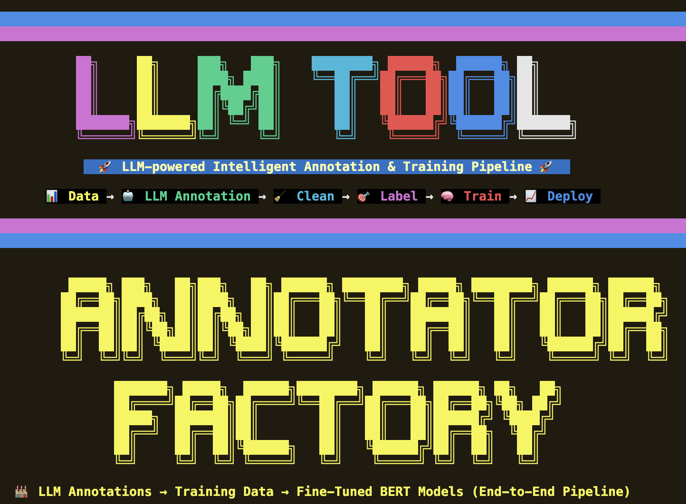
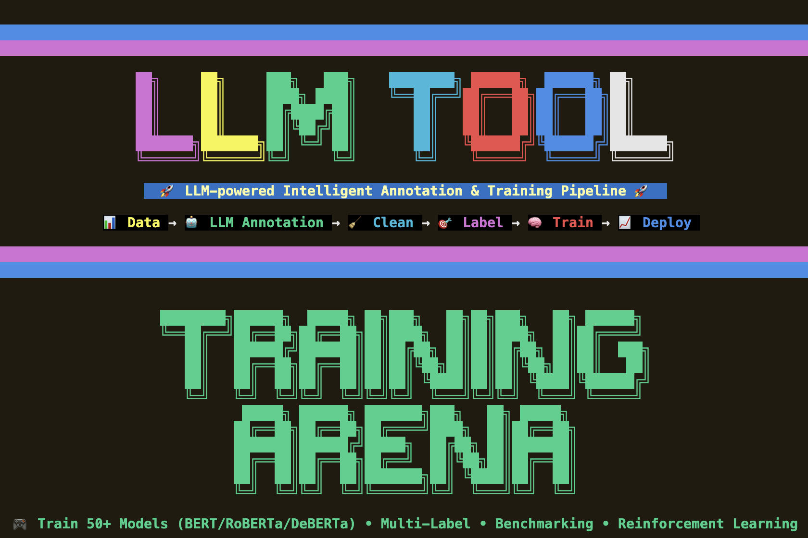
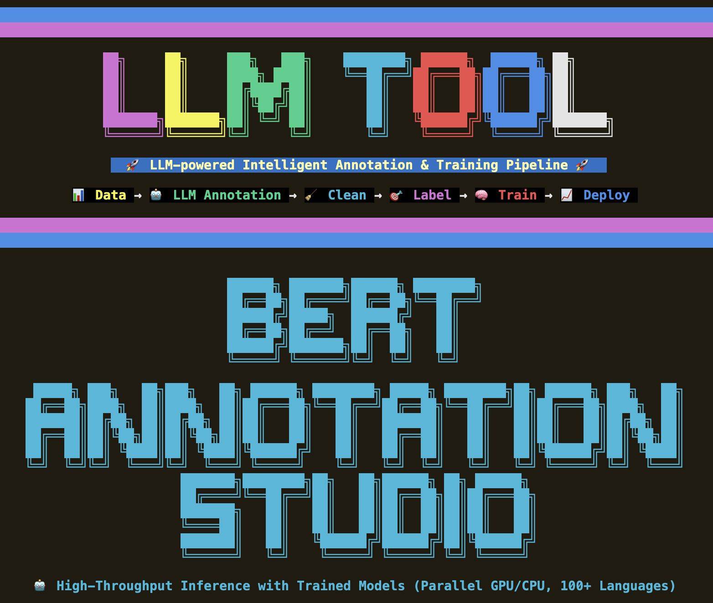
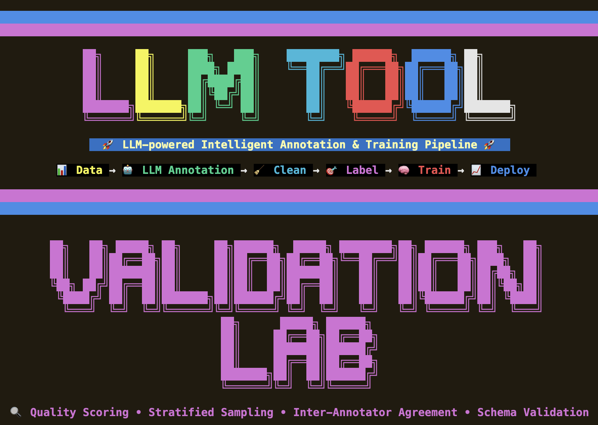

<div align="center">



<p align="center">
  
  
  
  
</p>

<p align="center">
  
  
  
</p>

<p align="center">
  
  
  
  
</p>

---

### 🎯 **Turn Research Data into ML Models, No Coding Required**

> 💻 100% Local Option • 🦙 Any Ollama Model • 🤖 Zero-Shot AI Annotation • 📊 Automated BERT Training • 🌍 75+ Languages

</div>

<p align="center">
  <video
    src="https://github.com/user-attachments/assets/98e7e206-ed6a-4313-828f-2d3909bef5fc"
    width="720"
    controls
    muted
    playsinline
    poster="img/LLM_Tool.png">
    Your browser does not support embedded videos.
    <a href="https://github.com/user-attachments/assets/98e7e206-ed6a-4313-828f-2d3909bef5fc">Download the MP4</a>.
  </video>
</p>

---

<div align="center">

### 🎬 Video Presentation (in French)

> **See LLM Tool in action!** Full presentation of the tool at the [CAPP (Centre d'Analyse des Politiques Publiques)](https://capp-ulaval.ca/) seminar, Université Laval, November 27, 2025.
>
> [-YouTube-FF0000?style=for-the-badge&logo=youtube&logoColor=white)](https://youtu.be/C0vN8WRaCE8?si=HBE33U0Sg_UC75Tl)

</div>

---

## 🎯 What is LLM Tool?

**LLM Tool is a platform that turns raw text data into trained machine learning models**, designed for researchers who want to use local or cloud LLMs without becoming programmers. It works with any open-source model available through Ollama, and automatically detects your hardware (GPU, CPU, RAM) to optimize performance.

### The Problem It Solves

As a social science researcher, you might have:

- **Thousands of survey responses** that need to be categorized by theme
- **Social media posts** that need sentiment analysis or topic classification
- **Interview transcripts** that require coding into analytical categories
- **News articles** that need to be classified by topic, stance, or framing
- **Historical documents** that require systematic categorization

**Traditional approaches are painful:**
- ❌ **Manual annotation** can be xtremely time-consuming (weeks/months for large datasets)
- ❌ **Existing ML tools** require programming skills, complex setup, and technical expertise
- ❌ **Commercial APIs** are costly at scale, raise data privacy concerns, and create vendor lock-in

### Why LLM Tool is Different

**LLM Tool makes recent AI models accessible through a simple, interactive interface:**

- ✅ **Local-first** annotate with any open-source model via Ollama (Llama, Gemma, Mistral, Nemotron, etc.), no API key needed
- ✅ **Cloud option** also supports OpenAI GPT and Google Gemini models when needed
- ✅ **Automatic resource detection** detects your GPU (NVIDIA CUDA, AMD ROCm, Apple MPS), CPU, and RAM to adapt batch sizes and parallelism
- ✅ **End-to-end pipeline** local LLM annotation → BERT training → production classifier, validated in the [technical paper](https://doi.org/10.31235/osf.io/6q8yg_v2) (Lemor et al., 2025)
- ✅ **Interactive CLI** guides you through every step, no coding required
- ✅ **Research-oriented design** supports inter-annotator agreement, stratified sampling, and quality metrics
- ✅ **Multilingual support** covers 75+ languages with automatic detection

### Who Should Use This?

- **Social Scientists** analyzing qualitative or mixed-method data
- **Political Scientists** coding news articles, speeches, or social media
- **Sociologists** categorizing interview responses or ethnographic notes
- **Communication Researchers** analyzing media content or discourse
- **Historians** classifying historical documents or archives
- **Digital Humanities** scholars working with large text corpora
- **Anyone** with text data that needs systematic categorization

**You don't need to know Python. You don't need to understand transformers. You just need data and research questions.**

---

## 📋 Table of Contents

- [What is LLM Tool?](#-what-is-llm-tool)
- [Rapid Start Cheat Sheet](#-rapid-start-cheat-sheet)
- [How It Works: The Workflow](#-how-it-works-the-workflow)
- [Architecture at a Glance](#-architecture-at-a-glance)
- [Features](#-features)
- [Workflow Intelligence & Tooling](#-workflow-intelligence--tooling)
- [Installation](#-installation)
  - [Windows guide (docs/WINDOWS.md)](docs/WINDOWS.md)
  - [GPU acceleration](#gpu-acceleration)
  - [Verify the installation](#verify-the-installation)
- [The 5 Modes Explained](#-the-5-modes-explained)
  - [Mode 1: The Annotator](#mode-1-the-annotator)
  - [Mode 2: The Annotator Factory](#mode-2-the-annotator-factory)
  - [Mode 3: Training Arena](#mode-3-training-arena)
  - [Mode 4: BERT Annotation Studio](#mode-4-bert-annotation-studio)
  - [Mode 5: Validation Lab](#mode-5-validation-lab)
- [Mode Playbook (Detailed Guide)](#-mode-playbook-detailed-guide)
- [Complete Example: From Raw Data to Trained Model](#-complete-example-from-raw-data-to-trained-model)
- [Annotation JSON Formats](#-annotation-json-formats)
- [Outputs & Directory Layout](#-outputs--directory-layout)
- [Data Connectors & Providers](#-data-connectors--providers)
- [Model Zoo Overview](#-model-zoo-overview)
- [Monitoring & Logs](#-monitoring--logs)
- [FAQ](#-faq)
- [Troubleshooting](#-troubleshooting)
- [Citation](#-citation)
- [License](#-license)

## 🚀 Rapid Start Cheat Sheet

> Ten minutes to move from checkout to your first annotated dataset.

### Install and launch

**Windows** (PowerShell — full guide: [docs/WINDOWS.md](docs/WINDOWS.md))

```powershell
git clone https://github.com/antoinelemor/LLM_Tool.git
cd LLM_Tool
.\install.bat
.\.venv\Scripts\Activate.ps1
llm-tool
```

**macOS / Linux**

```bash
git clone https://github.com/antoinelemor/LLM_Tool.git
cd LLM_Tool
chmod +x install.sh && ./install.sh --all
source .venv/bin/activate
llm-tool
```

The installer creates a private `.venv`, installs everything, and runs a
verification report. Expect 5–20 minutes and 3–6 GB of downloads.

> **Prerequisites:** Python 3.11+ and Git. Windows: `winget install -e --id Python.Python.3.12`
> and `winget install -e --id Git.Git`. macOS: `brew install python@3.12 git`.
> Optional but recommended: [Ollama](https://ollama.com) for fully local, free LLMs
> (`winget install -e --id Ollama.Ollama` / `brew install --cask ollama`).

### Then, inside the CLI

1. **Configure providers (optional)** – Mode 6 → Resume Center → **LLM providers**: add an OpenAI, Google Gemini or Anthropic key (stored encrypted, connection-tested), or configure the Ollama endpoint.
2. **Annotate a sample** – Mode 1 → pick `data/political_transcriptions_sample.csv` → choose columns → select `ollama:llama3.2` or `gpt-4o-mini` → run.
3. **Check quality** – Mode 5 → load the same output → request a 50-item stratified sample for review.
4. **Train a model** – Mode 3 → import the annotated CSV from `annotations_output/.../data/` → accept recommended multilingual models → run benchmarks.
5. **Deploy predictions** – Mode 4 → load the best checkpoint → annotate another dataset or rerun the original corpus at scale.
6. **Explore artefacts** – `annotations_output/`, `models/`, and `logs/` capture everything; see [Outputs & Directory Layout](#-outputs--directory-layout).

---

## 🔄 How It Works: The Workflow

LLM Tool offers **two main pathways** depending on your needs:

### **Pathway 1: AI-Assisted Annotation → Export for Human Review**

```
Your Data (CSV/Excel) → AI Annotation → Quality Check → Export to Label Studio/Doccano → Human Review
```

**Use when**: You want AI assistance but need human validation for publication-quality data.

### **Pathway 2: AI Annotation → Train Your Own Model → Automated Classification**

```
Your Data → AI Annotation → Train BERT Model → Use Model for New Data → Thousands of Classifications
```

**Use when**: You need to classify large volumes of data and can validate a sample for quality.

### **Pathway 3: Start from Scratch (You Already Have Labeled Data)**

```
Your Labeled Data → Train Multiple Models → Benchmark Performance → Deploy Best Model
```

**Use when**: You already have annotated training data and want the best custom model.

---

## 🧭 Architecture at a Glance

```
┌──────────────────────────────────────────────┐
│ 1. Prompt & schema design                    │
│    Researchers describe concepts/categories  │
│    • Prompt Wizard + AI drafting assistance  │
└───────────────┬──────────────────────────────┘
                │ structured prompt schema
                ▼
┌──────────────────────────────────────────────┐
│ 2. LLM-driven annotation of the source corpus│
│    • Local (Ollama) or cloud (GPT) LLMs │
│    • JSON repair, confidence scoring, resume │
└───────────────┬──────────────────────────────┘
                │ high quality annotated dataset
                ▼
┌──────────────────────────────────────────────┐
│ 3. Multilingual training & benchmarking      │
│    • 50+ transformer backbones               │
│    • Auto language routing & reinforcement   │
└───────────────┬──────────────────────────────┘
                │ production checkpoints & metrics
                ▼
┌──────────────────────────────────────────────┐
│ 4. Large-scale annotation & validation       │
│    • BERT Annotation Studio for deployment   │
│    • Validation Lab for QA & reviewer packs  │
└──────────────────────────────────────────────┘
```

- **Step 1 – Prompt design**: `llm_tool/cli/advanced_cli.py` with `annotators/prompt_wizard.py` captures the research taxonomy, optionally enlisting Ollama or GPT to draft crisp definitions and examples.
- **Step 2 – LLM annotation**: `annotators/llm_annotator.py` applies the schema to the initial corpus, handling retries, JSON cleansing, sample-size estimation, and incremental checkpoints.
- **Step 3 – Model training**: `trainers/model_trainer.py`, `trainers/multi_label_trainer.py`, and `trainers/training_data_builder.py` transform those annotations into multilingual benchmarks, select best-performing models, and persist artefacts.
- **Step 4 – Scaled inference & QA**: `cli/bert_annotation_studio.py` deploys checkpoints on large databases, while `validators/annotation_validator.py` orchestrates stratified sampling, agreement metrics, and exportable review sets.
- **Supporting services**: `utils/*` cover dataset discovery, language detection, resource monitoring, and session logging; `config/settings.py` secures credentials and paths; all artefacts land in `annotations_output/`, `models/`, `logs/`, and `~/.llm_tool/`.

---

## ✨ Features

### 🎨 **The Annotator** - Zero-Shot LLM Annotation

<p align="center">
  
</p>

- Annotate datasets using any Ollama model or OpenAI GPT
- Multi-prompt fusion with JSON validation and auto-repair (5-retry mechanism)
- Parallel processing with incremental saves and resume capability
- Export to Label Studio/Doccano for human review
- Statistical sample size calculation (95% confidence intervals)

### 🏭 **The Annotator Factory** - End-to-End Pipeline

<p align="center">
  
</p>

- LLM annotation → Training data preparation → Model fine-tuning (one-click workflow)
- Automatic language detection (96%+ accuracy with lingua)
- Smart class balancing and stratified splitting
- PostgreSQL, CSV, Excel, Parquet, JSON/JSONL, RData/RDS support
- Guided Deploy & Annotate stage hands trained checkpoints to BERT Annotation Studio with session metadata stored under `logs/annotator_factory/<session>/model_annotation/`

### 🎮 **Training Arena** - Model Training & Benchmarking

<p align="center">
  
</p>

- Train 70+ pre-trained models: BERT, RoBERTa, DeBERTa, ELECTRA, ALBERT, XLM-RoBERTa, CamemBERT, etc.
- Automatic model selection based on detected languages
- Multi-label classification with reinforcement learning
- Comprehensive benchmarking across multiple models
- Training session persistence with resume/relaunch capability
- Live metrics tracking (F1, accuracy, precision, recall, confusion matrix)

### 🤖 **BERT Annotation Studio** - Production Inference

<p align="center">
  
</p>

- High-throughput parallel inference (GPU/CPU)
- Batch processing with progress tracking
- Export annotations in multiple formats

### 🔍 **Validation Lab** - Quality Assurance

<p align="center">
  
</p>

- Annotation quality scoring
- Inter-annotator agreement (Cohen's Kappa)
- Stratified sampling for review
- Schema validation with Pydantic

---

## 🧠 Workflow Intelligence & Tooling

LLM Tool bundles a set of purposeful assistants so researchers can focus on methodology rather than plumbing.

- **Dataset radar** – `DataDetector` scans folders recursively, infers candidate text/label columns, and surfaces stats (row counts, average text length, language hints) before you commit to a run.
- **Prompt craftsmanship** – The Social Science Prompt Wizard (`annotators/prompt_wizard.py`) guides schema design, generates definitions with LLM assistance, sanitises JSON keys, and stores reusable templates.
- **Resumable pipelines** – `AnnotationResumeTracker`, `TrainingDatasetBuilder`, and `AnnotationStudioSessionManager` capture every stage (steps, payloads, artefacts) so you can exit and resume without losing context.
- **Live situational awareness** – The enhanced pipeline wrapper streams real annotation JSON samples, training benchmarks, and warnings into Rich dashboards, while `resource_display.py` prints GPU/CPU/RAM availability with guidance.
- **Quality fences** – JSON outputs are validated and auto-repaired up to five times, schema inconsistencies are flagged before exports, and validation runs compute agreement metrics with fully traceable provenance.
- **Security guardrails** – API keys are encrypted with Fernet, file permissions are hardened (`0700/0600`), warnings appear if encryption libraries are missing, and environment variables override stored secrets for reproducible jobs.
- **Local-first philosophy** – Ollama/LlamaCPP clients run entirely offline, datasets never leave your machine, and all artefacts write to the project workspace or `~/.llm_tool`.
- **Verification script** – `verify_installation.py` checks versions, dependency health, and GPU availability to simplify classroom or lab deployments.

---

## 🔧 Requirements

### Python Version
- **Python 3.11 or higher** — required, and enforced by the installer
- Tested on 3.11, 3.12 and 3.13; **3.12 is the recommended version**
- Must be a **64-bit** build (PyTorch publishes no 32-bit wheels)

### Operating System

| OS | Status | GPU acceleration |
|----|--------|------------------|
| **Windows 10 / 11** (x64) | Fully supported — see [docs/WINDOWS.md](docs/WINDOWS.md) | NVIDIA CUDA (opt-in install), otherwise CPU |
| **macOS** (Apple Silicon & Intel) | Fully supported | Apple MPS, automatic |
| **Linux** (x64) | Fully supported | NVIDIA CUDA / AMD ROCm |

Every dependency installs from a prebuilt wheel on all three platforms: **no C++
compiler, CMake or Rust toolchain is needed anywhere.**

### Hardware
- **Minimum**: 8 GB RAM, 4 CPU cores, ~10 GB free disk
- **Recommended**: 16+ GB RAM, 8+ CPU cores, GPU (NVIDIA/Apple MPS)
- **Optimal**: 32+ GB RAM, 16+ CPU cores, GPU with 8+ GB VRAM

### External Dependencies (Optional)
- **Ollama**: for local LLM inference — [ollama.com/download](https://ollama.com/download),
  or `winget install -e --id Ollama.Ollama` (Windows) / `brew install --cask ollama` (macOS)
- **PostgreSQL**: for database-backed datasets

---

## 📦 Installation

**One command on every platform.** Pick your operating system below — Windows
users have a dedicated, much more detailed guide in
**[docs/WINDOWS.md](docs/WINDOWS.md)**.

<table>
<tr><th>Windows 10 / 11</th><th>macOS / Linux</th></tr>
<tr valign="top"><td>

```powershell
git clone https://github.com/antoinelemor/LLM_Tool.git
cd LLM_Tool
.\install.bat
```

</td><td>

```bash
git clone https://github.com/antoinelemor/LLM_Tool.git
cd LLM_Tool
chmod +x install.sh
./install.sh --all
```

</td></tr>
</table>

Downloaded the ZIP instead of cloning? Extract it, open a terminal in the
extracted folder, and run the same installer line. On Windows you can simply
**double-click `install.bat`** in File Explorer.

---

### 1. Install the prerequisites

#### Python 3.11 or newer (3.12 recommended)

<table>
<tr><th>Windows</th><th>macOS</th><th>Linux</th></tr>
<tr valign="top"><td>

```powershell
winget install -e --id Python.Python.3.12
```

or the **64-bit** installer from
[python.org](https://www.python.org/downloads/windows/) —
**tick “Add python.exe to PATH”** on the first screen.

</td><td>

```bash
brew install python@3.12
```

or the installer from
[python.org](https://www.python.org/downloads/macos/).

</td><td>

```bash
sudo apt install python3.12 python3.12-venv   # Debian/Ubuntu
sudo dnf install python3.12                   # Fedora
```

</td></tr>
</table>

Check it worked — open a **new** terminal and run `py --version` (Windows) or
`python3 --version` (macOS/Linux).

#### Git

`winget install -e --id Git.Git` · `brew install git` · `sudo apt install git`

#### Visual Studio Code (optional but recommended)

Download from [code.visualstudio.com](https://code.visualstudio.com/) and
install the **Python extension**. The installer configures the workspace for
you, so the right interpreter is selected automatically.

> **You do not need** Visual Studio C++ build tools, CMake, Rust, Conda or
> Anaconda. Every dependency installs from a prebuilt package.

---

### 2. Get the code

**Option A — Git** (makes updating a one-liner later)

```bash
git clone https://github.com/antoinelemor/LLM_Tool.git
cd LLM_Tool
```

**Option B — ZIP**: use the green **Code → Download ZIP** button, then extract.

**Where to put it:** choose a **short, local path** such as `C:\Dev\LLM_Tool`
(Windows) or `~/Projects/LLM_Tool` (macOS/Linux). Avoid OneDrive-, iCloud- or
Dropbox-synced folders: they can lock or offload files mid-training and corrupt
checkpoints.

---

### 3. Run the installer

<details open>
<summary><b>Windows</b></summary>

```powershell
.\install.bat
```

The installer will:

- find the newest usable Python (3.13 → 3.12 → 3.11) and reject the Microsoft
  Store placeholder,
- warn about long paths, OneDrive and low disk space,
- create `.venv`, point VS Code at it, and install everything,
- run `verify_installation.py` and print a report.

Options:

| Command | Result |
|---------|--------|
| `.\install.bat` | Everything (default) |
| `.\install.bat -Preset core` | Pipeline only, ~2 GB smaller |
| `.\install.bat -Preset dev` | Core + pytest/black/mypy |
| `.\install.bat -Preset all -Cuda cu126` | Everything, with **GPU** PyTorch |
| `.\install.bat -Recreate` | Wipe `.venv` and start over |

> **Why `.bat` and not `.ps1`?** PowerShell blocks unsigned scripts by default,
> so `.\install.ps1` fails on a fresh machine with *“running scripts is disabled
> on this system”*. `install.bat` lifts that restriction **for one process
> only** — nothing on your machine is changed.

</details>

<details open>
<summary><b>macOS / Linux</b></summary>

```bash
chmod +x install.sh
./install.sh --all
```

| Command | Result |
|---------|--------|
| `./install.sh` | Core features |
| `./install.sh --all` | Everything (recommended) |
| `./install.sh --dev` | Core + development tooling |

</details>

<details>
<summary><b>Manual installation (any platform)</b></summary>

```bash
# 1. Create the virtual environment
py -3.12 -m venv .venv          # Windows
python3.12 -m venv .venv        # macOS / Linux

# 2. Activate it
.\.venv\Scripts\Activate.ps1    # Windows PowerShell
.venv\Scripts\activate.bat      # Windows Command Prompt
source .venv/Scripts/activate   # Windows Git Bash
source .venv/bin/activate       # macOS / Linux

# 3. Install
python -m pip install --upgrade pip setuptools wheel
pip install -e ".[all]"

# 4. Verify
python verify_installation.py
```

Keep the quotes around `".[all]"` — without them PowerShell and zsh both treat
the brackets as a glob and quietly install the core package only.

</details>

Expect **5–20 minutes** and **3–6 GB** of downloads, most of it PyTorch.

---

### 4. Launch

Every new terminal needs the environment activated first:

```powershell
.\.venv\Scripts\Activate.ps1     # Windows PowerShell
```
```bash
source .venv/bin/activate        # macOS / Linux
```

Your prompt then starts with `(.venv)`. Now run:

```bash
llm-tool
```

You should see the main menu:

```
     ╭─────────────────────────── Main Menu ───────────────────────────╮
     │ 1  🎨 The Annotator - LLM Tool annotates, you decide             │
     │ 2  🏭 The Annotator Factory - Clone The Annotator into ML Models │
     │ 3  🎮 Training Arena - Train Your Own Models                     │
     │ 4  🤖 BERT Annotation Studio - Annotate with Trained Models      │
     │ 5  🔍 Validation Lab - Quality Assurance Tools                   │
     │ 6  📂 Resume Center - Manage Sessions & Configurations           │
     │ 7  📚 Documentation & Help                                       │
     │ 0  ❌ Exit                                                       │
     ╰──────────────────────────────────────────────────────────────────╯

Select option [0/1/2/3/4/5/6/7] (1):
```

**🎉 Success! LLM Tool is running.**

`llmtool` and `python -m llm_tool` are equivalent entry points. If activation is
blocked on your machine, `.\.venv\Scripts\python.exe -m llm_tool` works without
it.

**In VS Code:** open the `LLM_Tool` folder, press `Ctrl+Shift+P` (`Cmd+Shift+P`
on macOS), run **Python: Select Interpreter**, and choose the one inside
`.venv`. New terminals (`` Ctrl+` ``) then activate it for you.

---

### Installation options

| Preset | Size | Contents |
|--------|------|----------|
| `core` | ~4 GB | The full pipeline: annotation, training, benchmarking, validation |
| `all` | ~6 GB | `core` + Anthropic & Gemini providers, the `--api` server, TensorBoard, MLflow, Weights & Biases, Optuna |
| `dev` | ~4 GB | `core` + pytest, black, flake8, mypy, isort, Jupyter |

```bash
pip install -e .            # core
pip install -e ".[all]"     # recommended
pip install -e ".[dev]"     # development
```

Two extras are **deliberately excluded from `all`** because they have no
prebuilt package on every platform and would try to compile C++ or Rust on your
machine:

```bash
pip install -e ".[llamacpp]"       # GGUF inference — needs CMake + a C++ compiler
pip install -e ".[fasttext]"       # fastText language ID — needs a C++ compiler
pip install -e ".[transcription]"  # Whisper + yt-dlp — also needs ffmpeg on PATH
```

Neither of the first two is required: **Ollama** covers local inference, and
language detection uses `lingua`, which is a core dependency.

---

### GPU acceleration

| Platform | Backend | How |
|----------|---------|-----|
| **macOS** (Apple Silicon) | MPS | Automatic — nothing to do |
| **Linux** (NVIDIA) | CUDA | Automatic — PyPI ships CUDA wheels for Linux |
| **Windows** (NVIDIA) | CUDA | **Opt-in**, see below |
| **Windows/Linux** (AMD, Intel) | — | CPU only (ROCm is Linux-only and not bundled) |

The PyPI build of PyTorch for **Windows is CPU-only**. To train on an NVIDIA GPU
there, install the CUDA build from PyTorch's own index:

```powershell
.\install.bat -Preset all -Cuda cu126
```

or, into an environment you already have:

```powershell
pip install --force-reinstall torch --index-url https://download.pytorch.org/whl/cu126
```

Pick the tag matching your driver (`cu126`, `cu128`, …); `nvidia-smi` reports the
highest CUDA version your driver supports. Check the result with:

```bash
python -c "import torch; print(torch.cuda.is_available())"
```

---

### Verify the installation

```bash
python verify_installation.py
```

**Expected output:**

```
═══════════════════════════════════════════════════════════
LLM TOOL - Installation Verification
═══════════════════════════════════════════════════════════
Checking Python version...
  ✓ Python 3.12.7 (OK)

Checking LLM Tool installation...
  ✓ llm-tool version 1.0.0

Checking core dependencies...
  ✓ Pandas                         version 2.3.3
  ✓ PyTorch                        version 2.8.0
  ✓ Matplotlib                     version 3.9.2
  ...

Checking console encoding...
  ✓ stdout encoding: utf-8

Checking GPU support...
  ✓ CUDA available: 1 device(s)
  # or: ✓ MPS (Apple Silicon) available
  # or: - No GPU detected (CPU only)

═══════════════════════════════════════════════════════════
✓ ALL CHECKS PASSED

LLM Tool is correctly installed and ready to use!
```

If anything fails, the script tells you the exact command to fix it. Windows
users: [docs/WINDOWS.md](docs/WINDOWS.md) has a troubleshooting section covering
execution policy, the Microsoft Store stub, `UnicodeEncodeError`, the 260-character
path limit and more.

---

### Updating

```bash
git pull
pip install -e ".[all]" --upgrade
```

### Uninstalling

Delete the project folder — the virtual environment, dependencies and models all
live inside it. Settings and stored API keys live in `~/.llm_tool`
(`%USERPROFILE%\.llm_tool` on Windows) and can be removed separately.

---

## 🚀 Quick Start

### 1. Configure API Keys (If Using Cloud LLMs)

LLM Tool stores API keys securely with encryption. Run the interactive CLI to set up:

```bash
llm-tool
```

Navigate to **Mode 6 → Resume Center → LLM providers** and add your keys. The
screen shows, per provider, whether its SDK is installed, whether a key is set
and where it came from, and can test the credential before you start a run:
- **OpenAI** (`OPENAI_API_KEY`) — GPT-4o, GPT-5, o1, o3
- **Google Gemini** (`GOOGLE_API_KEY`, or `GEMINI_API_KEY`) — get one free at [aistudio.google.com/apikey](https://aistudio.google.com/apikey)
- **Anthropic** (`ANTHROPIC_API_KEY`) — Claude

**OR** use environment variables:

```bash
export OPENAI_API_KEY="sk-..."            # macOS / Linux
```
```powershell
$env:OPENAI_API_KEY = "sk-..."            # Windows PowerShell, this session only
setx OPENAI_API_KEY "sk-..."              # Windows, permanent (new terminals only)
```

Recognised variables: `OPENAI_API_KEY`, `ANTHROPIC_API_KEY`, `GOOGLE_API_KEY`,
`OLLAMA_API_KEY`, `OLLAMA_HOST`. See [docs/API_KEY_MANAGEMENT.md](docs/API_KEY_MANAGEMENT.md).

### 2. Launch the Interactive CLI
```bash
llm-tool
```

You'll see the main menu:
```
╭─────────────────────────── Main Menu ───────────────────────────╮
│ 1  🎨 The Annotator - LLM Tool annotates, you decide             │
│ 2  🏭 The Annotator Factory - Clone The Annotator into ML Models │
│ 3  🎮 Training Arena - Train Your Own Models                     │
│ 4  🤖 BERT Annotation Studio - Annotate with Trained Models      │
│ 5  🔍 Validation Lab - Quality Assurance Tools                   │
│ 6  📂 Resume Center - Manage Sessions & Configurations           │
│ 7  📚 Documentation & Help                                       │
│ 0  ❌ Exit                        │
╰──────────────────────────────────────────────────────────────────╯
```

### 3. Quick Annotation Example (Using Ollama - 100% Local)

#### Install Ollama

```powershell
winget install -e --id Ollama.Ollama      # Windows
```
```bash
brew install --cask ollama                # macOS
curl -fsSL https://ollama.com/install.sh | sh   # Linux
```

Or download the installer for your platform from
[ollama.com/download](https://ollama.com/download). Then open a **new** terminal
and pull a model:

```bash
ollama pull llama3.2
ollama list
```

LLM Tool finds Ollama at `http://localhost:11434` automatically. Point it
elsewhere with `--ollama-host http://192.168.1.10:11434`, or use Ollama Cloud
with `--ollama-cloud --ollama-api-key "..."`.

#### Run Annotation
1. Launch `llm-tool`
2. Select **1 - The Annotator**
3. Choose your dataset (CSV/JSON/Excel/PostgreSQL)
4. Select text column and configure annotation schema
5. Choose **Ollama** as LLM provider → select `llama3.2`
6. Start annotation → Monitor progress → Export to Doccano/Label Studio

### 3bis. Annotate with Google Gemini (cloud, free tier available)

Gemini is a good middle ground: no local GPU needed, a generous free tier, a
1M-token context window, and **native schema-constrained JSON**, which is what
makes annotations parse reliably.

**Get a key** — free, no billing required to start:
[aistudio.google.com/apikey](https://aistudio.google.com/apikey)

```bash
export GOOGLE_API_KEY="..."          # macOS / Linux
```
```powershell
$env:GOOGLE_API_KEY = "..."          # Windows, this session
setx GOOGLE_API_KEY "..."            # Windows, permanent
```

`GEMINI_API_KEY` is accepted too, since that is the name Google's own
quickstarts use.

Or skip the environment entirely: **Mode 6 → Resume Center → LLM providers**
lists every provider with its SDK state and key status, stores keys encrypted,
and tests the connection before you commit to a run.

**Interactive:** launch `llm-tool`, choose Mode 1, and pick from the
**Google Gemini Models** section of the model picker.

**Headless:**

```bash
llm-tool --annotate data.csv --model gemini-3.6-flash --prompt prompt.txt
```

The provider is inferred from the model name (`gemini-*` → Google, `gpt-*` →
OpenAI, `claude-*` → Anthropic, anything else → Ollama); pass `--provider google`
to be explicit.

| Model | Use it for |
|-------|-----------|
| `gemini-3.6-flash` | **Default.** Best speed/quality balance for annotation |
| `gemini-3.7-flash` | Newest Flash generation |
| `gemini-3.5-flash-lite` | Cheapest tier, for very large corpora |
| `gemini-3.1-pro-preview` | Hardest tasks; slower and more expensive |
| `gemini-flash-latest` | Always the current Flash — but answers `503` under load more often than a pinned id |

Requires the `providers` extra, which `[all]` already includes:
`pip install -e ".[providers]"`.

> Google retires model generations for new keys. If you see *"no longer
> available to new users"*, the run stops immediately with a clear message
> instead of retrying every row — switch to a model from the table above.

---

### 4. Train Your First Model

1. Launch `llm-tool`
2. Select **3 - Training Arena**
3. Select **New Training Session**
4. Choose your annotated dataset
5. System auto-detects languages and recommends models
6. Select model (e.g., `bert-base-uncased` for English)
7. Configure epochs (default: 10)
8. Start training → Monitor live metrics → Best model saved automatically

---

## 💻 Usage in VSCode

### Step 1: Open Project in VSCode
```bash
cd LLM_Tool
code .
```

### Step 2: Select Python Interpreter

1. Press `Cmd+Shift+P` (macOS) or `Ctrl+Shift+P` (Windows/Linux)
2. Type "Python: Select Interpreter"
3. Choose the interpreter inside the project's virtual environment:
   - **Windows**: `.venv\Scripts\python.exe`
   - **macOS/Linux**: `.venv/bin/python`

Both installers write this into `.vscode/settings.json` for you, so it is
usually already selected — you should see `.venv` in the status bar.

### Step 3: Configure VSCode Terminal

Ensure your integrated terminal uses the virtual environment:

**File → Preferences → Settings** (or `Cmd+,`)

Search for `python.terminal.activateEnvironment` and ensure it's **checked**.

On Windows, the workspace also sets `PYTHONUTF8=1` for integrated terminals, so
the CLI's emoji and accented text render correctly.

### Step 4: Run LLM Tool from VSCode Terminal

Open integrated terminal (`Ctrl+` ` or **View → Terminal**):

```bash
# Terminal should show (.venv) prefix
llm-tool
```

> **Windows:** if the terminal opens without `(.venv)` and PowerShell reports
> that *running scripts is disabled*, either allow local scripts once with
> `Set-ExecutionPolicy -Scope CurrentUser -ExecutionPolicy RemoteSigned`, or set
> the integrated terminal's default profile to **Command Prompt**.

### Step 5: Debug Mode (Optional)

Create `.vscode/launch.json`:

```json
{
  "version": "0.2.0",
  "configurations": [
    {
      "name": "LLM Tool CLI",
      "type": "python",
      "request": "launch",
      "module": "llm_tool",
      "console": "integratedTerminal",
      "justMyCode": false
    }
  ]
}
```

Press `F5` to launch in debug mode.

### Step 6: Recommended VSCode Extensions

- **Python** (ms-python.python) - Python language support
- **Pylance** (ms-python.vscode-pylance) - Fast Python IntelliSense
- **Jupyter** (ms-toolsai.jupyter) - For notebook-based workflows
- **Rainbow CSV** (mechatroner.rainbow-csv) - CSV visualization

---

## 🎯 The 5 Modes Explained

LLM Tool has **5 specialized modes** for different stages of your research workflow. Each mode has a dedicated, interactive interface that guides you step-by-step.

---

### Mode 1: The Annotator

<p align="center">
  
</p>

**🎨 Zero-Shot Annotation with Large Language Models**

**What it does**: Uses any local Ollama model (or cloud GPT) to automatically annotate your text data based on a schema you define.

**Perfect for**:
- Creating initial training data from scratch
- Exploring what categories emerge from your data
- Getting a "first pass" on large datasets before human review
- Testing classification schemes quickly

**Real-World Example**:
> You have 5,000 social media posts about climate change. You want to classify each post's **stance** (supporter/denier/neutral) and **emotion** (angry/hopeful/fearful/neutral). Instead of manually coding all 5,000, you use The Annotator with a local Ollama model (e.g. gemma3:27b) to auto-annotate them in ~30 minutes, at no cost and with full data privacy.

#### What You'll See (Step-by-Step)

**Step 1: Select The Annotator**
```
Select option [0/1/2/3/4/5/6/7] (1): 1
```

**Step 2: Load Your Data**
```
📊 Select Your Data Source

╭─────┬──────────────────────────────────────────────────────╮
│ #   │ Data Source                                          │
├─────┼──────────────────────────────────────────────────────┤
│ 1   │ CSV File                                             │
│ 2   │ Excel File (.xlsx)                                   │
│ 3   │ JSON/JSONL File                                      │
│ 4   │ PostgreSQL Database                                  │
│ 5   │ Parquet File                                         │
│ 6   │ R Data File (.RData, .RDS)                           │
╰─────┴──────────────────────────────────────────────────────╯

Choose data source [1/2/3/4/5/6] (1): 1

📂 Enter path to CSV file: data/climate_posts.csv

✓ Loaded 5,243 rows from climate_posts.csv

Detected columns: ['post_id', 'text', 'author', 'date', 'likes']

Which column contains the text to annotate? text
```

**Step 3: Define Your Annotation Schema**
```
🏷️  Define Annotation Schema

You can:
  1. Use the Prompt Wizard (interactive, recommended)
  2. Load existing schema from file
  3. Define manually

Select option [1/2/3] (1): 1

╔════════════════════════════════════════════════════════════╗
║          Welcome to the Annotation Wizard! 🧙              ║
╚════════════════════════════════════════════════════════════╝

Let's design your annotation schema step by step.

What are you trying to annotate? (e.g., "sentiment", "topic", "stance"): stance

What categories should we use?
  Enter category 1: supporter
  Enter category 2: denier
  Enter category 3: neutral
  Enter category 4: [leave blank to finish]

✓ Schema created: 3 categories (supporter, denier, neutral)

Would you like to add additional fields? [y/n] (y): y

Additional field name: emotion
Type:
  1. Single choice (one category)
  2. Multiple choice (can select multiple)
  3. Free text

Select type [1/2/3] (1): 1

Emotion categories:
  Enter category 1: angry
  Enter category 2: hopeful
  Enter category 3: fearful
  Enter category 4: neutral
  Enter category 5: [leave blank to finish]

✓ Complete schema:
  - stance: single choice (supporter, denier, neutral)
  - emotion: single choice (angry, hopeful, fearful, neutral)
```

**Step 4: Choose Your LLM**
```
🤖 Select LLM Provider

╭─────┬────────────────────┬──────────────┬───────────────╮
│ #   │ Provider           │ Cost         │ Privacy       │
├─────┼────────────────────┼──────────────┼───────────────┤
│ 1   │ Ollama (Local)     │ FREE         │ 100% Private  │
│ 2   │ OpenAI (GPT-4)     │ ~$0.01/doc   │ Cloud-based   │
╰─────┴────────────────────┴──────────────┴───────────────╯

Select provider [1/2/3/4] (1): 1

🦙 Available Ollama Models:
  1. llama3.2 (recommended - 3B params, fast)
  2. mistral (7B params, balanced)
  3. phi3 (3.8B params, efficient)

Select model [1/2/3] (1): 1

✓ Using ollama:llama3.2 (100% local, no API costs)
```

**Step 5: Configure and Run**
```
⚙️  Annotation Configuration

╭─────────────────────────┬──────────────────────────────╮
│ Parameter               │ Value                        │
├─────────────────────────┼──────────────────────────────┤
│ Total documents         │ 5,243                        │
│ Sample size (95% CI)    │ 357                          │
│ Full dataset            │ 5,243                        │
│ Parallel workers        │ 4                            │
│ Estimated time          │ ~30 minutes (full)           │
│                         │ ~2 minutes (sample)          │
╰─────────────────────────┴──────────────────────────────╯

Annotate full dataset or statistical sample? [full/sample] (sample): full

🚀 Starting annotation...

Progress: ████████████████████░░░░░░░░░ 2,547/5,243 (48.6%)
Speed: 43 docs/min | ETA: 12:34 | Errors: 3 (0.1%)

[Real-time progress bar with live updates]
```

**Step 6: Review and Export**
```
✓ Annotation complete!

📊 Summary Statistics:
  Total annotated: 5,240 (3 failed)

  Stance distribution:
    - supporter: 2,341 (44.7%)
    - denier: 1,523 (29.1%)
    - neutral: 1,376 (26.3%)

  Emotion distribution:
    - angry: 1,873 (35.7%)
    - hopeful: 1,201 (22.9%)
    - fearful: 1,432 (27.3%)
    - neutral: 734 (14.0%)

📤 Export Options:
  1. CSV (for analysis)
  2. JSONL (for training)
  3. Doccano format (for human review)
  4. Label Studio format (for human review)
  5. All formats

Select export [1/2/3/4/5] (5): 5

✓ Exported to:
  - data/annotations/climate_posts_annotated.csv
  - data/annotations/climate_posts_annotated.jsonl
  - data/annotations/climate_posts_doccano.jsonl
  - data/annotations/climate_posts_labelstudio.json
```

**Key Features:**
- **100% Free Option**: Use Ollama (local) at no cost
- **Multi-Prompt Fusion**: Optionally use multiple prompts and merge results for higher accuracy
- **Incremental Saving**: Stops and resumes automatically if interrupted
- **Quality Metrics**: See confidence scores, detect anomalies
- **Statistical Sampling**: Annotate representative samples for pilot studies

---

### Mode 2: The Annotator Factory

<p align="center">
  
</p>

**🏭 Complete Pipeline: LLM Annotation → Training → Deployment**

**What it does**: Combines The Annotator, Training Arena, and BERT Annotation Studio into one seamless workflow. You provide raw data, it fabricates training corpora, benchmarks multiple checkpoints, and can immediately deploy the winner on any dataset.

**Perfect for**:
- You need a custom classifier but don't have labeled data
- You want the fastest path from raw data to deployed model
- You're okay with AI-generated training data (with validation)

**Real-World Example**:
> You have 10,000 news articles. You want a model that classifies them by topic (politics/sports/tech/health). The Factory uses a local Ollama model (or GPT) to annotate 1,000 articles, splits them into train/val/test, trains 3 different BERT models, benchmarks them, and then launches BERT Annotation Studio so you can label the remaining 9,000 rows in one pass.

#### What You'll See (Abbreviated Flow)

```
🏭 THE ANNOTATOR FACTORY

This mode runs the complete pipeline:
  Step 1: Load your data
  Step 2: LLM annotation
  Step 3: Data preparation
  Step 4: Model training
  Step 5: Benchmarking
  Step 6: Export best model
  Step 7: Deploy & annotate with BERT Studio

Estimated total time: 45-90 minutes

Continue? [y/n] (y): y

[Goes through same data loading as Mode 1]
[Goes through same annotation as Mode 1]

✓ Annotation complete: 1,000 documents annotated

🔧 Preparing training data...
  - Train set: 700 documents (70%)
  - Validation set: 150 documents (15%)
  - Test set: 150 documents (15%)
  - Class balance: ✓ Stratified

🌍 Detected languages: EN (100%)

🤖 Recommended models for English:
  1. bert-base-uncased (fast, good baseline)
  2. roberta-base (better performance)
  3. deberta-v3-base (best performance, slower)

Select models to benchmark [1,2,3 or all] (all): all

🎯 Training 3 models with 5-fold cross-validation...

Model 1/3: bert-base-uncased
  Epoch 1/5: ████████████ 100% | F1: 0.7234
  Epoch 2/5: ████████████ 100% | F1: 0.7891 ⬆
  [...]
  ✓ Best F1: 0.8123 (epoch 4)

Model 2/3: roberta-base
  [...]
  ✓ Best F1: 0.8456 (epoch 3)

Model 3/3: deberta-v3-base
  [...]
  ✓ Best F1: 0.8621 (epoch 4)

📊 Benchmark Results:
╭──────────────────┬──────────┬──────────┬──────────┬──────────╮
│ Model            │ F1 Score │ Accuracy │ Precision│ Recall   │
├──────────────────┼──────────┼──────────┼──────────┼──────────┤
│ deberta-v3-base  │ 0.8621   │ 0.8667   │ 0.8598   │ 0.8645   │
│ roberta-base     │ 0.8456   │ 0.8467   │ 0.8401   │ 0.8512   │
│ bert-base-uncased│ 0.8123   │ 0.8133   │ 0.8089   │ 0.8156   │
╰──────────────────┴──────────┴──────────┴──────────┴──────────╯

🏆 Best model: deberta-v3-base

✓ Exported to: models/news_classifier_deberta/
  - Model files: pytorch_model.bin, config.json
  - Tokenizer: tokenizer files
  - Metrics: benchmark_results.json
  - Training log: training.log

📦 DEPLOY & ANNOTATE (STEP 3/3)

Models trained in this session:
╭──────┬──────────────────────────────┬───────┬─────────╮
│  #   │ Model Identifier             │ Langs │ Macro F1│
├──────┼──────────────────────────────┼───────┼─────────┤
│  1   │ deberta-v3-base/best         │ EN    │ 0.862   │
│  2   │ roberta-base/best            │ EN    │ 0.846   │
╰──────┴──────────────────────────────┴───────┴─────────╯

Launch BERT Annotation Studio now? [y/n] (y): y

🎛 BERT Annotation Studio
  Dataset: data/news_articles.csv
  Text column: article_body
  Models: ['deberta-v3-base/best']
  Outputs: CSV + JSONL

🚀 Running inference...
✓ Predictions saved to logs/annotator_factory/factory_session_20250312/model_annotation/scored/news_articles_predictions.csv
✓ Deployment metadata archived at logs/annotator_factory/factory_session_20250312/metadata/model_annotation/model_annotation_20250312_153045.json
```

**What Makes This Special:**
- **Zero Manual Steps**: Fully automated from raw data to model
- **Multiple Model Comparison**: Always trains 2-3 models to find the best
- **Quality Checks**: Validates training data quality before training
- **Hands-Free Deployment**: Reuses the winning checkpoints inside BERT Annotation Studio, including dataset reuse, forced column mapping, and session metadata for resume
- **Reproducible**: Saves all configurations for replication

---

### Mode 3: Training Arena

<p align="center">
  
</p>

**🎮 Train & Benchmark Custom BERT Models (You Provide Labeled Data)**

**What it does**: Takes your already-labeled data and trains state-of-the-art transformer models. Supports 70+ model architectures in 15+ languages.

**Perfect for**:
- You already have labeled training data (from humans or LLM annotation)
- You want to compare multiple models to find the best one
- You need a model you can deploy and own (no API costs)
- You want to fine-tune for your specific domain

**Real-World Example**:
> You manually labeled 2,000 tweets for hate speech detection (hate/not hate). You want to train a model to classify millions more. Training Arena lets you train BERT, RoBERTa, and DeBERTa simultaneously, shows you which performs best, and gives you the trained model to use.

#### What You'll See

**Step 1: Choose Training Mode**
```
🎮 TRAINING ARENA

╭─────┬────────────────────────────────────────────────╮
│ #   │ Training Mode                                  │
├─────┼────────────────────────────────────────────────┤
│ 1   │ 🔄 Resume/Relaunch Training                    │
│     │    Load saved parameters from previous session │
│ 2   │ 🆕 New Training Session                        │
│     │    Start fresh with dataset selection          │
╰─────┴────────────────────────────────────────────────╯

Select option [1/2] (2): 2
```

**Step 2: Load Training Data**

The Training Arena accepts CSV files with a **text column** and a **JSON annotation column**. Three JSON annotation structures are supported and auto-detected:

| Structure | Example | Use Case |
|---|---|---|
| **Flat scalars** | `{"sentiment": "positive", "topic": "economy"}` | Simple classification (one value per key) |
| **Flat lists** | `{"themes": ["nationalism", "authority"]}` | Multi-label (multiple values per key) |
| **Nested (detected)** | `{"nationalism": {"detected": "yes", "subcategories": ["nation_threat"]}}` | LLM annotations with detection + subcategories |

Nested annotations are automatically flattened: the `detected` field becomes a yes/no label, and each subcategory becomes an individual label. All three structures can be mixed in the same dataset.

Supported file formats: CSV, JSON, JSONL, Excel, Parquet.

```
Enter path to dataset: data/hate_speech_labeled.csv

✓ Loaded 2,000 rows

Detected columns: ['tweet', 'label', 'annotator']

Text column: tweet
Label column: label

Label distribution:
  - hate: 734 (36.7%)
  - not_hate: 1,266 (63.3%)

⚠️  Class imbalance detected (36.7% vs 63.3%)
   → Recommendation: Enable reinforcement learning
```

**Step 3: Language Detection & Model Selection**
```
🌍 Language Detection

Analyzing text column...

Detected languages:
  - English (EN): 1,987 (99.3%)
  - Other: 13 (0.7%)

Primary language: English

🤖 Top 10 Recommended Models for EN:

╭───┬─────────────────────────┬─────────┬───────────┬──────────────╮
│ # │ Model ID                │ Size    │ Max Tokens│ Description  │
├───┼─────────────────────────┼─────────┼───────────┼──────────────┤
│ 1 │ bert-base-uncased       │ Base    │ 512       │ Solid        │
│   │                         │         │           │ baseline     │
│ 2 │ roberta-base            │ Base    │ 512       │ Better than  │
│   │                         │         │           │ BERT         │
│ 3 │ microsoft/deberta-v3-ba │ Base    │ 512       │ Best         │
│   │ se                      │         │           │ performance  │
│ 4 │ google/electra-base     │ Base    │ 512       │ Efficient    │
│ 5 │ distilbert-base-uncased │ Small   │ 512       │ Fast &       │
│   │                         │         │           │ lightweight  │
╰───┴─────────────────────────┴─────────┴───────────┴──────────────╯

Select model (enter number or model name): 3

✓ Selected: microsoft/deberta-v3-base
```

**Step 4: Training Configuration**
```
⚙️  Training Configuration

📏 Token Length Strategy

Your data stats:
  - Mean tokens: 42
  - Max tokens: 256
  - 95th percentile: 89

✓ All documents fit within 512 tokens → No special handling needed

🎓 Reinforced Learning for Class Imbalance?

What is it?
  - Automatically retrains if F1 < threshold
  - Oversamples minority class (hate: 36.7%)
  - Adjusts loss weights

Recommended for imbalanced datasets like yours.

Enable? [y/n] (y): y

⏱️  Training Epochs

Recommendation: 10 epochs (system auto-saves best checkpoint)

Number of epochs (10): 10

📊 Batch Size

Available GPU memory: 96 GB (Apple MPS)
Recommended batch size: 16

Batch size (16): 16

✅ Configuration Summary:
  Model: microsoft/deberta-v3-base
  Epochs: 10
  Batch size: 16
  Reinforcement: Enabled
  Early stopping: Enabled

Start training? [y/n] (y): y
```

**Step 5: Training Progress**
```
🚀 Training Started

Session ID: training_session_20250108_143045
Metadata will be automatically saved for resume capability

Epoch 1/10
━━━━━━━━━━━━━━━━━━━━━━━━━━━━━━━━━━━━━━━━━━━━━ 125/125 | 2:34

Train Loss: 0.4521 | Val Loss: 0.3891
Val F1: 0.7234 | Val Acc: 0.7467

Epoch 2/10
━━━━━━━━━━━━━━━━━━━━━━━━━━━━━━━━━━━━━━━━━━━━━ 125/125 | 2:31

Train Loss: 0.2891 | Val Loss: 0.2645
Val F1: 0.8123 ⬆ (NEW BEST! Checkpoint saved)

[...]

Epoch 7/10
━━━━━━━━━━━━━━━━━━━━━━━━━━━━━━━━━━━━━━━━━━━━━ 125/125 | 2:28

Train Loss: 0.0891 | Val Loss: 0.1823
Val F1: 0.8876 ⬆ (NEW BEST! Checkpoint saved)

Epoch 8/10
Train Loss: 0.0756 | Val Loss: 0.1891
Val F1: 0.8845 (no improvement)

⚠️  Early stopping triggered (patience: 2 epochs)

✓ Training complete!

📊 Final Results:
  Best epoch: 7
  Best validation F1: 0.8876
  Best validation accuracy: 0.8934
  Training time: 18 minutes 34 seconds

Model saved to: models/hate_speech_classifier/best_model/

Evaluate on test set? [y/n] (y): y

📈 Test Set Evaluation:
  F1 Score: 0.8821
  Accuracy: 0.8900
  Precision: 0.8756
  Recall: 0.8889

Confusion Matrix:
                Predicted
              hate  not_hate
Actual hate     147      18
     not_hate    22     253
```

**Key Features:**
- **70+ Models**: BERT, RoBERTa, DeBERTa, ELECTRA, CamemBERT, AraBERT, XLM-RoBERTa, etc.
- **Automatic Best Checkpoint**: Saves only the best-performing epoch
- **Resume Capability**: All sessions are saved and can be restarted
- **Multilingual**: Automatic model recommendation based on detected language
- **Benchmarking**: Compare multiple models in one run

---

### Mode 4: BERT Annotation Studio

<p align="center">
  
</p>

**🤖 High-Throughput Inference with Your Trained Models**

**What it does**: Uses your trained BERT models to annotate large datasets at scale (thousands per hour).

**Perfect for**:
- You trained a model and now have new data to classify
- You need to process tens of thousands of documents
- You want fast, parallelized inference (GPU/CPU)

**Real-World Example**:
> You trained a hate speech detector (Mode 3). Now you have 50,000 new tweets to classify. Instead of manually reviewing them, you use BERT Annotation Studio with your trained model to classify all 50,000 in ~15 minutes.

#### What You'll See

```
🤖 BERT ANNOTATION STUDIO

Step 1: Load Trained Model

Available models:
  1. models/hate_speech_classifier/
  2. models/news_classifier_deberta/
  3. models/sentiment_analyzer/

Select model [1/2/3] (1): 1

✓ Loaded: hate_speech_classifier
  Architecture: microsoft/deberta-v3-base
  Classes: ['hate', 'not_hate']
  Device: MPS (Apple Silicon GPU)

Step 2: Load Data to Annotate

Enter path: data/new_tweets.csv

✓ Loaded 50,000 rows

Text column: tweet_text

Step 3: Configure Inference

Batch size (auto-optimized for GPU): 32
Parallel workers: 4

Estimated time: ~12 minutes

Start inference? [y/n] (y): y

🚀 Running inference...

Progress: ████████████████████████ 42,341/50,000 (84.7%)
Speed: 3,821 docs/min | ETA: 2:01

✓ Complete!

Results:
  - hate: 4,523 (9.0%)
  - not_hate: 45,477 (91.0%)

Export to: data/new_tweets_classified.csv

✓ Exported with columns:
  - Original: [tweet_text, date, user_id, ...]
  - Added: [predicted_label, confidence_score]
```

**Key Features:**
- **GPU Acceleration**: Uses CUDA/MPS if available, falls back to CPU
- **Parallel Processing**: Multi-core CPU or multi-GPU
- **Confidence Scores**: Know how certain the model is
- **Batch Optimization**: Automatically finds optimal batch size

---

### Mode 5: Validation Lab

<p align="center">
  
</p>

**🔍 Quality Assurance & Inter-Annotator Agreement**

**What it does**: Analyzes annotation quality, computes inter-annotator agreement, and helps you identify problematic examples.

**Perfect for**:
- Checking LLM annotation quality before using it for training
- Comparing human annotators' agreement
- Finding edge cases or ambiguous examples
- Preparing data for publication (need reliability metrics)

**Real-World Example**:
> You used GPT-4 to annotate 1,000 documents. Before training a model on this data, you want to validate quality. You also had 2 human annotators code a random sample of 100. Validation Lab computes Cohen's Kappa, identifies low-confidence annotations, and flags disagreements.

#### What You'll See

```
🔍 VALIDATION LAB

Step 1: Load Annotations

Primary annotations: data/gpt4_annotations.jsonl
✓ Loaded 1,000 annotations

Compare with second annotator? [y/n] (y): y
Secondary annotations: data/human_annotations.jsonl
✓ Loaded 100 annotations (overlapping sample)

Step 2: Quality Metrics

📊 Primary Annotator (GPT-4) Quality:
  - Mean confidence: 0.87
  - Low confidence (<0.5): 23 (2.3%)
  - Label distribution:
      positive: 456 (45.6%)
      negative: 321 (32.1%)
      neutral: 223 (22.3%)

📊 Inter-Annotator Agreement (100 overlapping):
  - Percent agreement: 89.0%
  - Cohen's Kappa: 0.832 (substantial agreement)
  - Krippendorff's Alpha: 0.829

  Per-category agreement:
    positive: 94% (47/50)
    negative: 86% (31/36)
    neutral: 86% (12/14)

⚠️  Disagreement Analysis:
  Found 11 disagreements

  Top disagreement pattern:
    GPT-4: neutral → Human: positive (6 cases)

  Export disagreements for review? [y/n] (y): y

  ✓ Exported to: data/validation/disagreements.csv

Step 3: Quality Issues Detection

🔍 Scanning for potential issues...

Low-confidence annotations (confidence < 0.6):
  - 23 found
  - Median confidence: 0.52
  - Preview: [shows first 5]

Possible mislabels (model uncertainty):
  - 14 found (high entropy)

Class imbalance:
  ✓ No severe imbalance detected

Export quality report? [y/n] (y): y

✓ Report saved to: data/validation/quality_report.html
```

**Key Features:**
- **Inter-Annotator Metrics**: Cohen's Kappa, Krippendorff's Alpha
- **Confidence Analysis**: Identify uncertain predictions
- **Disagreement Patterns**: Find systematic differences
- **Stratified Sampling**: Generate balanced review samples
- **HTML Reports**: Beautiful visualizations for presentations

---

## 🗂 Mode Playbook (Detailed Guide)

Need a structured checklist for each mode? The **Mode Playbook** in `docs/modes_reference.md` distils the CLI into repeatable steps with inputs, outputs, logging paths, and hand-offs.

| Mode | What it delivers | Deep dive |
|------|------------------|-----------|
| Mode 1 – The Annotator | Zero-shot LLM annotation with JSON repair, sampling, and exports. | [docs/modes_reference.md#mode-1--the-annotator](docs/modes_reference.md#mode-1--the-annotator) |
| Mode 2 – Annotator Factory | End-to-end pipeline tying annotation, cleaning, splitting, training, and deployment via BERT Studio. | [docs/modes_reference.md#mode-2--the-annotator-factory](docs/modes_reference.md#mode-2--the-annotator-factory) |
| Mode 3 – Training Arena | Multilingual benchmarks across 50+ transformer architectures. | [docs/modes_reference.md#mode-3--training-arena](docs/modes_reference.md#mode-3--training-arena) |
| Mode 4 – BERT Annotation Studio | Production inference with checkpoint orchestration and rich monitoring. | [docs/modes_reference.md#mode-4--bert-annotation-studio](docs/modes_reference.md#mode-4--bert-annotation-studio) |
| Mode 5 – Validation Lab | QA lab for sampling, agreement metrics, and reviewer packs. | [docs/modes_reference.md#mode-5--validation-lab](docs/modes_reference.md#mode-5--validation-lab) |
| Mode 6 – Profile Manager | Encrypted credential vault and reusable prompt/model presets. | [docs/modes_reference.md#mode-6--profile-manager](docs/modes_reference.md#mode-6--profile-manager) |

> Tip: From inside the CLI you can press `?` on most prompts to open the same guidance inline. The playbook mirrors that content in a printable format for classroom handouts or lab manuals.

---

## 📖 Complete Example: From Raw Data to Trained Model

**Scenario**: You're a political scientist studying online political discourse. You have 10,000 tweets about a recent election and want to classify them by **sentiment** (positive/negative/neutral) and **topic** (economy/immigration/healthcare/other).

### Step 1: Use The Annotator (Mode 1)

```bash
llm-tool
```

1. Select **1 - The Annotator**
2. Load data: `data/election_tweets.csv` (10,000 tweets)
3. Use **Prompt Wizard** to define schema:
   - Field 1: `sentiment` → Categories: positive, negative, neutral
   - Field 2: `topic` → Categories: economy, immigration, healthcare, other
4. Choose **Ollama (local)** to keep it free and private
5. Annotate statistical sample (95% CI): **370 tweets** in ~5 minutes
6. Review results, export to `data/election_tweets_annotated.jsonl`

**Result**: 370 annotated tweets, ready for human review or training.

### Step 2: Validate Quality (Mode 5)

Since you used AI annotation, check quality first:

1. Select **5 - Validation Lab**
2. Load your annotations: `data/election_tweets_annotated.jsonl`
3. Optionally compare with 50 human-coded tweets (if you have them)
4. Review metrics:
   - Mean confidence: 0.84 (good)
   - Cohen's Kappa (vs human): 0.78 (substantial agreement)
   - Low confidence: 23 tweets (6.2%) → Flag for manual review
5. Export disagreements and low-confidence cases to CSV

**Decision**: Quality is good enough to proceed with training.

### Step 3: Train a Model (Mode 3)

1. Select **3 - Training Arena**
2. Load annotated data: `data/election_tweets_annotated.jsonl`
3. System detects English, recommends models
4. Select **benchmark mode** to compare 3 models:
   - bert-base-uncased
   - roberta-base
   - microsoft/deberta-v3-base
5. Enable **reinforcement learning** (for any class imbalance)
6. Train for 10 epochs (~20 minutes total)
7. Review benchmark results:
   ```
   Best model: microsoft/deberta-v3-base
   Test F1: 0.86 | Accuracy: 0.87
   ```
8. Model saved to `models/election_sentiment_classifier/`

**Result**: Production-ready model, trained and validated.

### Step 4: Classify Remaining Data (Mode 4)

Now apply your model to the full 10,000 tweets:

1. Select **4 - BERT Annotation Studio**
2. Load model: `models/election_sentiment_classifier/`
3. Load remaining data: `data/election_tweets_full.csv` (9,630 unannotated)
4. Run inference: ~6 minutes on GPU
5. Export results: `data/election_tweets_classified.csv`

**Result**: All 10,000 tweets classified with sentiment and topic.

### Step 5: Analyze Results

Open `election_tweets_classified.csv` in Excel/R/Python:
- Each tweet has `predicted_sentiment`, `predicted_topic`, `confidence_score`
- Filter by confidence > 0.8 for high-quality subset
- Analyze distributions, trends over time, correlations
- Publish findings with methodology: "LLM annotation (Llama 3.2) + BERT classification (DeBERTa-v3-base, F1=0.86)"

**Total Time**: ~45 minutes (from raw data to 10,000 classified tweets)

**Total Cost**: $0 (using Ollama locally)

---

## 🏷️ Annotation JSON Formats

When you bring your own labelled data (or inspect what the LLM annotators produce), the labels live in a JSON **`annotation`** column (one JSON object per row). This is what gets converted into training data. Two shapes are supported.

### Multi-label list (one key, the labels that apply)

A single key (e.g. `themes`) whose value is the **list of labels that apply** to the sentence:

```json
{"themes": ["democracy", "authority"]}   // positive for democracy AND authority
{"themes": []}                            // negative for EVERY theme
```

In one-vs-all training each label becomes its own binary classifier. A label **present** in the list is a **positive**; a label **absent** is a **negative** for that classifier. An **empty list** is a valid row that is negative for all labels. Use this when every sentence is genuinely judged against every label.

### Explicit yes / no / absent (per-label control)

When you want to mark each label explicitly — and in particular to **exclude** some rows from a given label (e.g. to cap negatives and balance classes) — give each label a value of `"yes"` or `"no"`, and simply **omit** the labels that should not count for that row:

```json
{"democracy": "yes", "authority": "no", "ecology": "no"}
// democracy → positive
// authority, ecology → negative
// every other label → ABSENT ⇒ this row is skipped for it (neither positive nor negative)
```

| Per label | Meaning |
|---|---|
| `"yes"` | **positive** |
| `"no"` | **negative** |
| *key not present* | **skipped** — the row does not count for that label at all |

This is the clean way to down-sample negatives to a target ratio (e.g. 3 negatives per positive) inside a **single** file: set `"yes"` on the positives, `"no"` on the negatives you want to keep, and leave the surplus negatives out so they are skipped. (Internally these become `label_yes` / `label_no` tokens, but you only ever write `"yes"` / `"no"`.)

### Single-label / multi-class (one key, one value)

For a single categorical label per row, use a scalar value:

```json
{"sentiment": "positive"}
{"topic": "economy"}
```

### Empty or missing annotation = row excluded

If the `annotation` cell is empty, `null`, `NaN`, an empty object `{}`, or unparseable JSON, the **entire row is dropped** before training (neither positive nor negative for anything). This differs from `{"themes": []}`, which is kept as an all-negative row. Use a blank cell when you want a sentence ignored completely.

---

## 📁 Outputs & Directory Layout

```
LLM_Tool/
├── annotations_output/
│   └── <session_id>/
│       ├── data/                  # CSV/JSONL outputs (incremental + final)
│       ├── prompts/               # Frozen prompt definitions per run
│       ├── validation_exports/    # Label Studio / Doccano packets
│       ├── training_data/         # Factory pre-processed corpora
│       └── metadata/              # Resume files, stats, run manifests
├── models/
│   └── <session_id>/
│       ├── checkpoints/           # Hugging Face-compatible model weights
│       ├── metrics/               # JSON + HTML benchmarking reports
│       └── training_logs/         # Trainer transcripts and charts
├── logs/
│   ├── annotator/                 # Mode 1 session logs
│   ├── annotator_factory/         # Mode 2 pipeline logs (annotation → training → deployment)
│   │   └── <session>/model_annotation/   # BERT Studio runs launched from the factory
│   ├── training_arena/            # Mode 3 resumes + diagnostics
│   ├── annotation_studio/         # Mode 4 session caches
│   └── application/               # Global logs (llmtool_<timestamp>.log)
├── cache/                         # Temporary datasets, embeddings, etc.
└── prompts/                       # User-authored prompt templates

~/.llm_tool/                       # Windows: %USERPROFILE%\.llm_tool\
├── api_keys.enc                   # Encrypted credentials
├── profiles/                      # Saved mode configurations
└── history.json                   # Execution history for quick resume
```

Everything except `~/.llm_tool/` is created **relative to the directory you run
`llm-tool` from**, so a project folder stays self-contained and portable.

Keep these directories under version control (where appropriate) to guarantee reproducibility and shareable research artefacts.

> **Windows note:** dataset and model names are truncated when used as directory
> or file components, because Windows rejects any path over 260 characters
> unless long path support is enabled. Run the project from a short path such as
> `C:\Dev\LLM_Tool` and see [docs/WINDOWS.md](docs/WINDOWS.md#enable-long-paths).

---

## 🔌 Data Connectors & Providers

| Source | Status | Notes |
|--------|--------|-------|
| CSV / TSV | ✅ | Delimited files with auto encoding detection and chunked loading. |
| Excel (`.xlsx`, `.xls`) | ✅ | Uses `pandas` with sheet selection prompts. |
| JSON / JSONL | ✅ | Supports nested fields, `jsonl` streaming, optional schema hints. |
| Parquet | ✅ | Fast columnar loading, ideal for large corpora. |
| PostgreSQL | ✅ | Connect via DSN; supports SQL filtering and sampling. |
| RData / RDS | ✅ (optional `pyreadr`) | Load labelled datasets from R workflows. |
| Remote APIs | ⏳ | Export to Label Studio/Doccano; reconnect using their SDKs if needed. |

LLM providers available in Mode 1 and 2:

- **Ollama (local)** any open-source model: Llama 3.3/3.2, Gemma 3, Mistral, Nemotron, Phi, Command-R, and any model available via `ollama pull`. No API key, no cost, full privacy.
- **Ollama Cloud** the same API hosted at `https://ollama.com`, for models too large to run locally: Gemma 4, GLM-5.x, Kimi K3, DeepSeek V4, Qwen 3.5, MiniMax M3, Nemotron 3, Mistral Large 3, GPT-OSS. Needs an API key (`OLLAMA_API_KEY`, or store one for the `ollama` provider); nothing else changes.
- **OpenAI (cloud)** GPT-4, GPT-4o, o1, o3 family via `openai` SDK.
- **Google Gemini (cloud)** Gemini 3.x Flash / Flash-Lite / Pro via the `google-genai` SDK. 1M-token context and native schema-constrained JSON, so annotations parse without fence-stripping. Free tier available; needs `GOOGLE_API_KEY` (or `GEMINI_API_KEY`). Included in the `providers` and `all` extras.
- **Anthropic (cloud)** Claude family via the `anthropic` SDK (client implemented; catalogue not yet populated).

Both Ollama endpoints appear in the model picker, can be reachability-tested from it before a run starts, and accept a hand-typed model name. Point the tool at any other Ollama server with `OLLAMA_HOST`.

Each provider can be pinned per profile; the CLI tracks preferred models and warns if credentials are missing.

---

## 🤖 Model Zoo Overview

**LLM annotation engines (Mode 1/2)**:

- **Local models (Ollama)**: any open-source model, including large models tested and validated for the forthcoming paper (Lemor et al., 2025): Nemotron (42 GB), GPT-OSS:120B (65 GB), Gemma 3:27B (17 GB), as well as smaller models like Llama 3.3/3.2, Mistral, Mixtral, Phi 3, Command-R, etc.
- **Ollama Cloud models**: frontier open-weight models that will not fit on a workstation — Gemma 4, Qwen 3.5, GLM-5.1/5.2, Kimi K2.6/K3, DeepSeek V4 Flash/Pro, MiniMax M2.7/M3, Nemotron 3 Nano/Super/Ultra, Mistral Large 3, GPT-OSS 20B/120B.
- **Cloud models**: OpenAI GPT-4, GPT-4o, o1, o3.
- JSON validation ensures outputs conform to structured schema regardless of provider.

**Training backbones (Mode 3)** – curated sets per language:

- **English**: BERT base/large, RoBERTa base/large, DeBERTa v3, ELECTRA, ALBERT.
- **French**: CamemBERT, FlauBERT, BARThez, DistilCamemBERT.
- **Spanish**: BETO, RoBERTa-BNE, MarIA.
- **German**: GBERT, German BERT cased.
- **Multilingual**: XLM-RoBERTa (base/large), mDeBERTa, DistilBERT multilingual, mMiniLM.
- **Long sequence**: Longformer, BigBird, LongT5 for legislative debates or interviews.
- **Multi-label toolkit**: Binary one-vs-all, automatic multiclass grouping, reinforced epochs, per-label model selection.

Trained checkpoints are standard Hugging Face directories and can be pushed to private/model hubs if desired.

---

## 📈 Monitoring & Logs

- **Installation diagnostics** – `python verify_installation.py` prints dependency versions, GPU availability (CUDA/MPS), and CLI entry-point checks.
- **Runtime dashboards** – Rich panels display annotation throughput, retry counts, benchmark leaderboards, and resource usage.
- **Application logs** – `logs/application/llmtool_<timestamp>.log` captures warnings, stack traces, configuration snapshots (without secrets).
- **Mode-specific logs** – Each session folder (`logs/<mode>/<session>/`) contains `resume.json`, human-readable transcripts, and progress JSON for programmatic inspection.
- **Metrics & Reports** – Training metrics in `models/<session>/metrics/`, validation HTML reports in `annotations_output/<session>/validation_exports/quality_report.html`.
- **Data provenance** – Session summaries (`logs/.../summary.json`) record data sources, prompt versions, model hashes, and environment info for replication packages.

---

## ❓ FAQ

### General Questions

**Q: Do I need to know how to code?**
A: No. The interactive CLI guides you through every step with menus and prompts. However, if you want to automate workflows, `llm-tool --batch config.json` runs the whole pipeline headlessly, and `llm-tool --help` lists the direct actions (`--annotate`, `--train`, `--benchmark`, `--validate`).

**Q: Is this free to use?**
A: The software is free (MIT license). Using Ollama (local LLMs) is also free. Cloud APIs (OpenAI) have costs (~$0.001-$0.01 per document).

**Q: Can I use this offline?**
A: Yes, with Ollama. Everything runs on your computer: no internet, no data sharing.

**Q: What languages are supported?**
A: 75+ languages with automatic detection. Specialized models for: English, French, Spanish, German, Chinese, Arabic, Russian, Japanese, Hindi, Portuguese, Italian, Polish, Dutch, Swedish, and more.

### Technical Questions

**Q: What hardware do I need?**
A: Minimum: 8 GB RAM, any CPU. Recommended: 16 GB RAM, GPU (NVIDIA/Apple Silicon). Works on macOS, Linux, Windows.

**Q: How long does training take?**
A: Depends on dataset size and hardware:
- 1,000 documents on M2 Max (MPS): ~8 minutes
- 1,000 documents on CPU (16 cores): ~25 minutes
- 10,000 documents on RTX 3090: ~15 minutes

**Q: Can I use my own BERT model from HuggingFace?**
A: Yes! Training Arena accepts any HuggingFace model ID. Just type the model name when prompted.

**Q: How accurate is LLM annotation?**
A: Depends on the task and model:
- Simple tasks (sentiment): 80-90% accuracy (comparable to humans)
- Complex tasks (nuanced framing): 65-80% accuracy
- Always validate with Mode 5 (Validation Lab) before trusting fully

**Q: Can I export for human review?**
A: Yes. Mode 1 exports to **Doccano** and **Label Studio** formats, which are popular open-source annotation platforms.

### Data & Privacy Questions

**Q: Where is my data stored?**
A: Locally on your computer in the `data/` directory. If you use Ollama, everything stays on your machine.

**Q: If I use OpenAI, where does my data go?**
A: Data is sent to their APIs for processing. Check their privacy policies. For sensitive data, use Ollama (100% local).

**Q: Can I delete my data?**
A: Yes, it's all in your `LLM_Tool/data/` folder. Delete it anytime.

**Q: What about GDPR/IRB compliance?**
A: Using Ollama (local) = no data sharing = easier compliance. For cloud APIs, check your institution's policies.

### Workflow Questions

**Q: Should I annotate my full dataset or a sample?**
A: For pilot studies: annotate a sample (Mode 1 calculates sample size). For final analysis: either annotate full dataset with LLM, or use LLM to annotate a sample, train a model (Mode 3), then classify the full dataset (Mode 4).

**Q: Can I combine human and AI annotations?**
A: Yes! Common workflow:
1. LLM annotates full dataset (Mode 1)
2. Humans review a sample (export to Label Studio)
3. Train on combined data (Mode 3)
4. Validate quality (Mode 5)

**Q: What if my categories change mid-project?**
A: You'll need to re-annotate. Save your prompts/schemas (Mode 6 - Profile Manager) for reproducibility.

**Q: Can I fine-tune GPT ?**
A: No, but you can fine-tune BERT/RoBERTa/DeBERTa models (Mode 3), which you fully own and can deploy anywhere.

---

## 🏗️ Architecture

```
LLM_Tool/
├── llm_tool/
│   ├── annotators/          # LLM annotation engines
│   │   ├── llm_annotator.py         # Core annotation orchestrator
│   │   ├── api_clients.py           # OpenAI/Anthropic/Google clients
│   │   ├── local_models.py          # Ollama/LlamaCPP integration
│   │   ├── prompt_wizard.py         # Interactive prompt creation
│   │   └── json_cleaner.py          # JSON repair & validation
│   │
│   ├── trainers/            # Model training & benchmarking
│   │   ├── model_trainer.py         # Training orchestration
│   │   ├── bert_base.py             # Base BERT implementation
│   │   ├── multi_label_trainer.py   # Multi-label classification
│   │   ├── benchmarking.py          # Model comparison
│   │   ├── models.py                # Standard model catalog
│   │   └── sota_models.py           # 50+ SOTA models
│   │
│   ├── cli/                 # Command-line interfaces
│   │   ├── advanced_cli.py          # Rich interactive CLI
│   │   ├── main_cli.py              # Simple CLI
│   │   └── bert_annotation_studio.py
│   │
│   ├── validators/          # Quality control
│   │   ├── annotation_validator.py  # Quality metrics
│   │   └── doccano_exporter.py      # Export utilities
│   │
│   ├── utils/               # Utilities
│   │   ├── language_detector.py     # 96%+ accuracy detection
│   │   ├── system_resources.py      # GPU/CPU monitoring
│   │   ├── metadata_manager.py      # Session persistence
│   │   └── training_data_utils.py   # Data preparation
│   │
│   ├── pipelines/           # Pipeline orchestration
│   ├── config/              # Configuration & API key management
│   └── database/            # Data handlers (PostgreSQL, files)
│
├── data/                    # Data storage
├── models/                  # Trained model storage
├── prompts/                 # Prompt templates
└── docs/                    # Documentation
```

---

## 🔬 Advanced Features

### Multi-Label Classification
Train models that predict multiple labels per document:
```python
# Example: Document can be tagged with ["politics", "international", "economics"]
Training Arena → Multi-label strategy → Automatic threshold optimization
```

### Reinforcement Learning
Automatically handles class imbalance with adaptive retraining:
- F1 threshold monitoring
- Minority class oversampling
- Adaptive learning rate adjustment
- Loss weight balancing

### Language Detection
Automatic detection of 75+ languages using lingua (96%+ accuracy):
- Per-document language tagging
- Language-specific model recommendations
- Mixed-language dataset support
- Separate models per language option

### Prompt Engineering Wizard
Interactive wizard for creating effective annotation prompts:
- Context configuration
- Few-shot examples
- Output schema definition
- Multi-prompt strategies

### Session Management
All training sessions are persisted and recallable:
- Resume interrupted training
- Relaunch with same parameters
- Session history browsing
- Metadata tracking (model, dataset, hyperparameters)

### Benchmarking Mode
Compare multiple models before committing to full training:
- Quick evaluation (3-5 epochs)
- Performance comparison table
- Class-wise F1 scores
- Confusion matrices
- Automatic best model selection

---

## 🐛 Troubleshooting

> **On Windows?** [docs/WINDOWS.md](docs/WINDOWS.md) has a dedicated
> troubleshooting section covering the PowerShell execution policy, `python`
> opening the Microsoft Store, MSVC build errors, `UnicodeEncodeError`, the
> 260-character path limit, OneDrive and antivirus interference.

### Issue: "ModuleNotFoundError: No module named 'llm_tool'"
**Solution**: Ensure virtual environment is activated and package is installed:
```bash
source .venv/bin/activate         # macOS/Linux
# source .venv/Scripts/activate   # Windows (Git Bash)
# .venv\Scripts\Activate.ps1      # Windows (PowerShell)
# .venv\Scripts\activate.bat      # Windows (Command Prompt)
pip install -e .
```

### Issue (Windows): "running scripts is disabled on this system"
**Solution**: PowerShell blocks unsigned scripts by default. Use the wrapper,
which bypasses it for one process without changing the machine:
```powershell
.\install.bat
```
To allow local scripts permanently (also fixes `Activate.ps1`):
```powershell
Set-ExecutionPolicy -Scope CurrentUser -ExecutionPolicy RemoteSigned
```

### Issue (Windows): typing `python` opens the Microsoft Store
**Solution**: Windows ships a placeholder `python.exe`. Use `py` instead, or turn
the alias off in **Settings → Apps → Advanced app settings → App execution
aliases**. The installer detects and skips the placeholder automatically.

### Issue (Windows): `UnicodeEncodeError: 'charmap' codec can't encode character`
**Solution**: The console is on a legacy code page. LLM Tool forces UTF-8 on
itself at startup, so this should not appear — if it does:
```powershell
$env:PYTHONUTF8 = "1"      # this session
setx PYTHONUTF8 1          # permanent (new terminals)
```

### Issue (Windows): "Microsoft Visual C++ 14.0 or greater is required"
**Solution**: A package fell back to a source build. This should not happen for
`core`, `all` or `dev` on Python 3.11–3.13 — check `py --version` first. If you
asked for the `llamacpp` or `fasttext` extras, they genuinely need a compiler:
```powershell
winget install -e --id Microsoft.VisualStudio.2022.BuildTools
```
(select **Desktop development with C++**). Use Ollama instead of `llamacpp` to
avoid this entirely.

### Issue: VS Code integrated terminal freezes or flickers
**Solution**: LLM Tool now throttles Rich updates automatically inside Electron/VS Code terminals, but you can fine-tune the behaviour:

- `LLM_TOOL_RICH_PROFILE=safe|balanced|full|off` – choose a preset refresh profile (`safe` is default for VS Code).
- `LLM_TOOL_FORCE_RICH_UI=1` – force the full dashboard even when a conservative profile was auto-selected.
- `LLM_TOOL_RICH_REFRESH_HZ=<float>` – manually cap refresh rate (e.g. `3` to redraw three times per second).
- `LLM_TOOL_RICH_MIN_RENDER_INTERVAL=<seconds>` – minimum delay between live updates.
- `LLM_TOOL_DISABLE_RICH_UI=1` – fall back to plain-text logs (useful for very constrained terminals).
- `LLM_TOOL_UPDATE_THROTTLE=<seconds>` – global minimum delay between training dashboard refreshes (overrides auto-detection).
- `LLM_TOOL_VSCODE_SAFE_THROTTLE=<seconds>` – cadence used when VS Code is detected (defaults to 60 s to keep Electron stable).
- `LLM_TOOL_VSCODE_MIN_THROTTLE=<seconds>` – lowest refresh interval allowed inside VS Code when you force a faster rate.
- `LLM_TOOL_TERMINAL_CLEAR_INTERVAL=<seconds>` – periodically clear the integrated terminal scrollback (set to `0` to disable).

Set the variable before launching `llm-tool`:
```bash
export LLM_TOOL_RICH_PROFILE=balanced     # macOS / Linux
```
```powershell
$env:LLM_TOOL_RICH_PROFILE = "balanced"   # Windows PowerShell
```
```bat
set LLM_TOOL_RICH_PROFILE=balanced        :: Windows Command Prompt
```

### Issue: "CUDA out of memory" during training
**Solution**: Reduce batch size in Training Arena settings:
- Try batch size: 8 → 4 → 2
- Use CPU-only mode if GPU memory is limited
- Close other GPU-intensive applications

### Issue: `torch.cuda.is_available()` is False on a Windows NVIDIA machine
**Solution**: The PyPI build of PyTorch for Windows is CPU-only. Install the
CUDA build from PyTorch's own index:
```powershell
pip install --force-reinstall torch --index-url https://download.pytorch.org/whl/cu126
```
Pick the tag matching your driver — `nvidia-smi` reports the highest CUDA
version it supports.

### Issue: Ollama connection refused
**Solution**: Ensure Ollama is running:
```bash
# Check if Ollama is reachable (any platform)
curl http://localhost:11434/api/tags
```
On **macOS/Linux**, start it with `ollama serve`. On **Windows** Ollama runs as a
background service installed with the app — launch **Ollama** from the Start
menu, or check it in Task Manager. If it is stuck:
```powershell
Stop-Process -Name ollama -Force
```
then relaunch it from the Start menu.

### Issue: MPS backend errors (macOS Apple Silicon)
**Solution**: Fall back to CPU:
```bash
export PYTORCH_ENABLE_MPS_FALLBACK=1
llm-tool
```

### Issue: API rate limits (OpenAI)
**Solution**: Configure rate limiting in Advanced CLI settings:
- Reduce concurrent requests
- Add delay between batches
- Use batch API endpoints (OpenAI)

### Issue: "Training session not found" when resuming
**Solution**: Ensure metadata files exist:
```bash
ls logs/training_arena/
# Should show training_session_YYYYMMDD_HHMMSS/ directories with training_metadata.json
```

---

## 📊 Performance Benchmarks

**Annotation Speed** (Ollama Llama 3.2 on M2 Max):
- 15-30 documents/minute (depends on prompt complexity)
- Parallel processing: 50-100 documents/minute (4 workers)

**Training Speed** (BERT-base, 5K documents):
- Apple M2 Max (MPS): ~8 min/epoch
- NVIDIA RTX 3090: ~3 min/epoch
- CPU (16 cores): ~25 min/epoch

**Inference Speed** (Trained BERT, batch size 32):
- Apple M2 Max (MPS): ~500 docs/second
- NVIDIA RTX 3090: ~1200 docs/second
- CPU (16 cores): ~150 docs/second

---

## 🤝 Contributing

Contributions are welcome! Please:
1. Fork the repository
2. Create a feature branch (`git checkout -b feature/amazing-feature`)
3. Commit your changes (`git commit -m 'Add amazing feature'`)
4. Push to the branch (`git push origin feature/amazing-feature`)
5. Open a Pull Request

---

## 📚 Citation

A [technical paper](https://doi.org/10.31235/osf.io/6q8yg_v2) validating the full local LLM → BERT training pipeline is available on SocArXiv. The pipeline was tested with large open-source models running locally via Ollama (Nemotron 42 GB, GPT-OSS:120B 65 GB, Gemma 3:27B 17 GB), confirming that open-source local models can produce training data of sufficient quality to train competitive BERT classifiers.

If you use LLM Tool in your research, please cite the preprint:

```bibtex
@unpublished{lemor2026llmtool,
  author       = {Lemor, Antoine and Dinan, Shannon and Gilbert, Jérémy},
  title        = {{LLM Tool}: A Hybrid Pipeline for Automated High-Throughput Text Annotation Using Local Language Models and {BERT} Classifiers},
  year         = {2026},
  note         = {SocArXiv preprint, v2},
  doi          = {10.31235/osf.io/6q8yg_v2},
  howpublished = {\url{https://osf.io/preprints/socarxiv/6q8yg_v2}}
}
```

**In-text citation (APA):**
> Lemor, A., Dinan, S., & Gilbert, J. (2026). *LLM Tool: A Hybrid Pipeline for Automated High-Throughput Text Annotation Using Local Language Models and BERT Classifiers* [Preprint]. SocArXiv. https://doi.org/10.31235/osf.io/6q8yg_v2

**Methodology description for papers:**
> "Text classification was performed using LLM Tool (Lemor, Dinan, & Gilbert, 2026), an open-source hybrid pipeline for LLM-assisted annotation and BERT model training. Documents were initially annotated using local LLMs (e.g., Ollama Llama 3.2) or cloud models (GPT‑4) following a custom annotation schema. A stratified subset of N documents was manually validated (Cohen's Kappa = X.XX). The final classifier was trained using the [model name] transformer architecture and achieved an F1 score of X.XX on held-out test data."

---

## 📄 License

This project is licensed under the **MIT License**. You are free to use, modify, and distribute this software for any purpose, including commercial applications.

See [LICENSE](LICENSE) file for full details.

---

## 🙏 Acknowledgments

LLM Tool builds on the work of many amazing open-source projects:

- **HuggingFace Transformers** provides the base for all BERT/RoBERTa/DeBERTa models
- **Ollama** enables local LLM inference
- **PyTorch** powers model training
- **Rich** handles terminal UI rendering
- **OpenAI** provides cloud LLM APIs for zero-shot annotation
- **The open-source ML community** contributes pre-trained models and research

Special thanks to all contributors and early adopters who provided feedback.

---

## 🤝 Contributing

Contributions are welcome! Whether it's:
- 🐛 Bug reports
- ✨ Feature requests
- 📖 Documentation improvements
- 🧪 New model integrations
- 🌍 Translations

Please see [CONTRIBUTING.md](CONTRIBUTING.md) for guidelines.

---

## 📬 Support & Community

**Need help?**
- 📖 **Read the docs**: Check `docs/` folder for detailed guides
- 💬 **Ask questions**: Open a GitHub Discussion
- 🐛 **Report bugs**: Open a GitHub Issue
- 💡 **Request features**: Open a GitHub Issue with the "enhancement" label

**Stay updated:**
- ⭐ Star this repository to get notifications
- 👀 Watch for new releases and features
- 🔔 Check [CHANGELOG.md](CHANGELOG.md) for version history

---

## 🌟 Why LLM Tool Matters

**Traditional annotation is time-consuming.** Manually labeling thousands of documents takes months. Hiring annotators requires training and quality control. Off-the-shelf solutions lack flexibility for custom research questions.

**LLM Tool addresses this** by combining local open-source LLMs (via Ollama) or cloud GPT with fine-tuned BERT models, giving researchers:

- ✅ **Speed** annotate 1,000 documents in minutes instead of weeks
- ✅ **Cost** use free local models (Ollama) or affordable cloud APIs
- ✅ **Quality** validate with inter-annotator agreement metrics
- ✅ **Ownership** train models you control and can deploy anywhere
- ✅ **Flexibility** supports any language and any classification scheme
- ✅ **Transparency** full control over methodology, reproducible workflows

**Built for social scientists, by social scientists.** LLM Tool was designed for researchers who need rigorous, reproducible, and publication-ready text classification without requiring a PhD in computer science.

---

**Made for researchers**

*Turn your text data into production-ready ML models*
